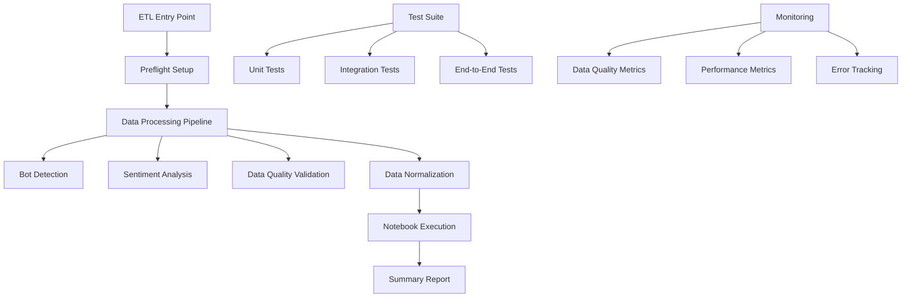

# Design Document

## Overview

The bulletproof ETL system design focuses on creating a robust, testable, and maintainable data processing pipeline for YouTube analytics. The system will leverage the existing codebase structure while implementing comprehensive error handling, testing, and monitoring capabilities. The design emphasizes fail-fast principles, comprehensive logging, and modular architecture to ensure reliability and maintainability.

## Architecture

### High-Level Architecture



### Core Components

1. **ETL Orchestrator** (`tools/etl/run_focused_etl.py`)
   - Main entry point for pipeline execution
   - Coordinates all processing stages
   - Handles error propagation and reporting

2. **Processing Modules**
   - Sentiment Analysis (`tools/etl/sentiment_analysis.py`)
   - Bot Detection (`src/youtubeviz/bot_detection.py`)
   - Data Normalization (`src/youtubeviz/normalization.py`)
   - Data Quality Validation (new module)

3. **Testing Framework**
   - Unit tests for individual components
   - Integration tests for database operations
   - End-to-end pipeline tests
   - Performance benchmarking

4. **Monitoring and Logging**
   - Comprehensive logging with structured output
   - Performance metrics collection
   - Data quality scoring
   - Error tracking and alerting

## Components and Interfaces

### ETL Pipeline Interface

```python
class ETLPipeline:
    """Main ETL pipeline orchestrator."""

    def __init__(self, config: ETLConfig):
        self.config = config
        self.engine = get_engine()
        self.logger = setup_logging()

    def run(self) -> ETLResult:
        """Execute the complete ETL pipeline."""
        pass

    def run_stage(self, stage_name: str) -> StageResult:
        """Execute a specific pipeline stage."""
        pass
```

### Data Processing Interfaces

```python
class SentimentProcessor:
    """Handles sentiment analysis for comments."""

    def process_batch(self, comments: List[Comment]) -> List[SentimentResult]:
        """Process sentiment for a batch of comments."""
        pass

    def validate_results(self, results: List[SentimentResult]) -> ValidationReport:
        """Validate sentiment analysis results."""
        pass

class BotDetector:
    """Detects bot patterns in comments."""

    def analyze_comments(self, df: pd.DataFrame) -> pd.DataFrame:
        """Analyze comments for bot patterns."""
        pass

    def generate_report(self, results: pd.DataFrame) -> BotReport:
        """Generate bot detection summary report."""
        pass

class DataNormalizer:
    """Normalizes video and artist data."""

    def normalize_videos(self) -> int:
        """Normalize video data and return count of processed records."""
        pass

    def link_isrc_codes(self) -> int:
        """Link ISRC codes to videos and return count of linked records."""
        pass
```

### Testing Interfaces

```python
class ETLTestSuite:
    """Comprehensive test suite for ETL pipeline."""

    def run_unit_tests(self) -> TestResults:
        """Run unit tests for individual components."""
        pass

    def run_integration_tests(self) -> TestResults:
        """Run integration tests with database."""
        pass

    def run_performance_tests(self) -> PerformanceResults:
        """Run performance benchmarks."""
        pass

class DatabaseTestHelper:
    """Helper for database testing operations."""

    def setup_test_data(self) -> None:
        """Set up test data for testing."""
        pass

    def cleanup_test_data(self) -> None:
        """Clean up test data after testing."""
        pass

    def validate_data_integrity(self) -> ValidationReport:
        """Validate database integrity."""
        pass
```

## Data Models

### ETL Configuration

```python
@dataclass
class ETLConfig:
    """Configuration for ETL pipeline execution."""
    batch_size: int = 200
    max_retries: int = 3
    timeout_seconds: int = 300
    enable_bot_detection: bool = True
    enable_sentiment_analysis: bool = True
    quality_threshold: float = 80.0
    log_level: str = "INFO"
```

### Processing Results

```python
@dataclass
class ETLResult:
    """Result of ETL pipeline execution."""
    status: str  # SUCCESS, FAILED, PARTIAL
    start_time: datetime
    end_time: datetime
    stages_completed: List[str]
    stages_failed: List[str]
    metrics: Dict[str, Any]
    errors: List[str]

@dataclass
class StageResult:
    """Result of individual pipeline stage."""
    stage_name: str
    status: str
    duration_seconds: float
    records_processed: int
    errors: List[str]
    metrics: Dict[str, Any]
```

### Data Quality Models

```python
@dataclass
class DataQualityReport:
    """Comprehensive data quality assessment."""
    overall_score: float
    issues: List[QualityIssue]
    recommendations: List[str]
    statistics: Dict[str, Any]

@dataclass
class QualityIssue:
    """Individual data quality issue."""
    severity: str  # CRITICAL, HIGH, MEDIUM, LOW
    category: str  # MISSING_DATA, INVALID_FORMAT, DUPLICATE, etc.
    description: str
    affected_records: int
    suggested_fix: str
```

## Error Handling

### Error Classification

1. **Critical Errors** - Stop pipeline execution
   - Database connection failures
   - Invalid configuration
   - Missing required data

2. **Recoverable Errors** - Retry with backoff
   - Temporary network issues
   - API rate limiting
   - Transient database errors

3. **Data Errors** - Log and continue
   - Invalid comment text
   - Missing metadata
   - Format inconsistencies

### Error Handling Strategy

```python
class ErrorHandler:
    """Centralized error handling for ETL pipeline."""

    def handle_error(self, error: Exception, context: Dict[str, Any]) -> ErrorAction:
        """Determine appropriate action for error."""
        if isinstance(error, CriticalError):
            return ErrorAction.STOP_PIPELINE
        elif isinstance(error, RecoverableError):
            return ErrorAction.RETRY_WITH_BACKOFF
        else:
            return ErrorAction.LOG_AND_CONTINUE

    def retry_with_backoff(self, func: Callable, max_retries: int = 3) -> Any:
        """Execute function with exponential backoff retry."""
        pass
```

## Testing Strategy

### Test Categories

1. **Unit Tests**
   - Individual function testing
   - Mock external dependencies
   - Fast execution (< 1 second per test)
   - 90%+ code coverage target

2. **Integration Tests**
   - Database operations
   - API interactions
   - Component interactions
   - Use test database

3. **End-to-End Tests**
   - Complete pipeline execution
   - Real data scenarios
   - Performance validation
   - Longer execution time acceptable

### Test Data Management

```python
class TestDataManager:
    """Manages test data for ETL testing."""

    def create_sample_videos(self, count: int = 10) -> List[Video]:
        """Create sample video data for testing."""
        pass

    def create_sample_comments(self, video_ids: List[str], count: int = 100) -> List[Comment]:
        """Create sample comment data for testing."""
        pass

    def setup_test_database(self) -> None:
        """Set up isolated test database."""
        pass

    def cleanup_test_database(self) -> None:
        """Clean up test database after tests."""
        pass
```

### Performance Testing

```python
class PerformanceTester:
    """Performance testing for ETL components."""

    def benchmark_sentiment_analysis(self, comment_count: int) -> PerformanceMetrics:
        """Benchmark sentiment analysis performance."""
        pass

    def benchmark_bot_detection(self, comment_count: int) -> PerformanceMetrics:
        """Benchmark bot detection performance."""
        pass

    def benchmark_full_pipeline(self, data_size: str) -> PerformanceMetrics:
        """Benchmark complete pipeline performance."""
        pass
```

## Implementation Plan

### Phase 1: Core Infrastructure
- Implement robust error handling framework
- Create comprehensive logging system
- Set up test database infrastructure
- Implement basic performance monitoring

### Phase 2: Component Testing
- Create unit tests for all existing components
- Implement integration tests for database operations
- Add performance benchmarks for critical components
- Set up continuous integration testing

### Phase 3: Data Quality Framework
- Implement comprehensive data quality checks
- Create data validation rules
- Add automated quality reporting
- Implement quality threshold enforcement

### Phase 4: Pipeline Orchestration
- Enhance ETL pipeline with robust error handling
- Implement stage-by-stage execution tracking
- Add comprehensive result reporting
- Implement automatic retry mechanisms

### Phase 5: Monitoring and Alerting
- Implement real-time monitoring
- Add performance metrics collection
- Create alerting for critical failures
- Implement trend analysis for quality metrics

## Security Considerations

1. **Data Protection**
   - Sanitize sensitive data in logs
   - Implement secure database connections
   - Protect API keys and credentials

2. **Input Validation**
   - Validate all external inputs
   - Sanitize user-generated content
   - Prevent SQL injection attacks

3. **Access Control**
   - Implement proper database permissions
   - Secure configuration files
   - Audit data access patterns

## Performance Optimization

1. **Database Optimization**
   - Implement connection pooling
   - Optimize query performance
   - Use appropriate indexes

2. **Processing Optimization**
   - Implement batch processing
   - Use parallel processing where appropriate
   - Optimize memory usage

3. **Monitoring and Tuning**
   - Track processing times
   - Monitor resource usage
   - Implement performance alerts
