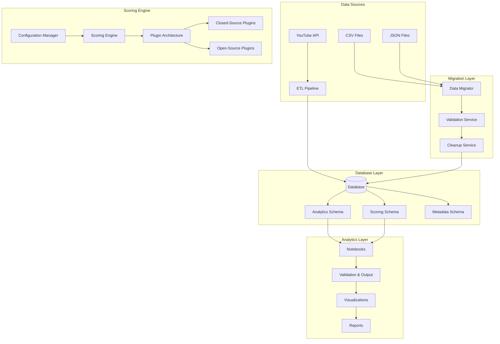

# Design Document

## Overview

The Data Organization and Scoring System transforms the current YouTube ETL platform from a file-based data storage approach to a robust database-centric architecture with a flexible, plugin-based scoring system. The design consolidates scattered CSV/JSON files into normalized database tables while providing a configurable scoring framework that supports both closed-source proprietary algorithms and open-source user-defined scoring plugins.

## Architecture

### High-Level Architecture



### Integration with Existing System

The design maintains backward compatibility while introducing new capabilities:

- **Existing**: Scattered CSV/JSON files in root, config/, data/, music_analysis_tables/
- **Enhanced**: Centralized database storage with proper schema design
- **Migration**: Automated tools to move existing data to database tables
- **Scoring**: Plugin-based system replacing hardcoded scoring logic

## Components and Interfaces

### 1. Data Migration and Organization System

**Purpose**: Consolidate scattered data files into organized database tables

**Key Classes**:
```python
class DataMigrator:
    """Migrates CSV/JSON files to database tables"""

    def migrate_csv_files(self, source_dir: str, target_schema: str) -> MigrationResult
    def migrate_json_files(self, source_dir: str, target_schema: str) -> MigrationResult
    def validate_migration(self, source_files: List[str], target_tables: List[str]) -> ValidationResult
    def create_backup(self, files: List[str]) -> BackupResult

class DataValidator:
    """Validates data integrity during migration"""

    def validate_csv_structure(self, file_path: str, expected_schema: Dict) -> ValidationResult
    def validate_json_schema(self, file_path: str, schema_definition: Dict) -> ValidationResult
    def check_data_consistency(self, source_data: Any, migrated_data: Any) -> ConsistencyResult
    def generate_validation_report(self, results: List[ValidationResult]) -> ValidationReport

class DatabaseSchemaManager:
    """Manages database schema creation and updates"""

    def create_analytics_schema(self) -> None
    def create_scoring_schema(self) -> None
    def create_metadata_schema(self) -> None
    def migrate_schema(self, from_version: str, to_version: str) -> MigrationResult
    def validate_schema_integrity(self) -> ValidationResult
```

### 2. Plugin-Based Scoring System

**Purpose**: Flexible, configurable scoring system supporting multiple algorithms

**Core Architecture**:
```python
class ScoringEngine:
    """Main scoring engine with plugin support"""

    def __init__(self, config_manager: ConfigurationManager)
    def register_plugin(self, plugin: ScoringPlugin) -> None
    def execute_scoring(self, algorithm_name: str, data: pd.DataFrame) -> ScoringResult
    def get_available_algorithms(self) -> List[str]
    def validate_plugin(self, plugin: ScoringPlugin) -> ValidationResult

class ScoringPlugin(ABC):
    """Abstract base class for scoring plugins"""

    @abstractmethod
    def get_name(self) -> str
    @abstractmethod
    def get_version(self) -> str
    @abstractmethod
    def get_parameters(self) -> Dict[str, Any]
    @abstractmethod
    def calculate_scores(self, data: pd.DataFrame) -> pd.DataFrame
    @abstractmethod
    def validate_input(self, data: pd.DataFrame) -> ValidationResult

class ClosedSourceScoringPlugin(ScoringPlugin):
    """Proprietary scoring algorithms (kept closed-source)"""

    def calculate_momentum_score(self, metrics: pd.DataFrame) -> pd.Series
    def calculate_engagement_score(self, comments: pd.DataFrame) -> pd.Series
    def calculate_growth_potential(self, historical_data: pd.DataFrame) -> pd.Series

class OpenSourceScoringPlugin(ScoringPlugin):
    """Base class for user-defined scoring plugins"""

    def load_configuration(self, config: Dict[str, Any]) -> None
    def export_results(self, scores: pd.DataFrame, format: str) -> None
```

### 3. Configuration Management System

**Purpose**: Environment-based configuration for scoring parameters

**Key Classes**:
```python
class ConfigurationManager:
    """Manages scoring configuration from environment variables and database"""

    def load_scoring_config(self, algorithm_name: str) -> ScoringConfig
    def validate_parameters(self, config: ScoringConfig) -> ValidationResult
    def update_configuration(self, algorithm_name: str, new_config: Dict) -> None
    def get_environment_config(self) -> EnvironmentConfig
    def audit_configuration_changes(self, changes: List[ConfigChange]) -> None

class ScoringConfig:
    """Configuration data class for scoring algorithms"""

    algorithm_name: str
    version: str
    parameters: Dict[str, Any]
    environment: str
    created_at: datetime
    updated_at: datetime

    def validate(self) -> ValidationResult
    def to_dict(self) -> Dict[str, Any]
    def from_env_vars(self, prefix: str) -> 'ScoringConfig'
```

### 4. Database Schema Design

**Purpose**: Normalized schema for analytics data storage

**Analytics Schema**:
```sql
-- Core analytics tables
CREATE TABLE analytics_runs (
    run_id VARCHAR(50) PRIMARY KEY,
    run_timestamp TIMESTAMP NOT NULL,
    data_source VARCHAR(100) NOT NULL,
    records_processed INT NOT NULL,
    status ENUM('running', 'completed', 'failed') NOT NULL,
    metadata JSON,
    INDEX idx_timestamp (run_timestamp),
    INDEX idx_status (status)
);

CREATE TABLE artist_metrics (
    metric_id BIGINT AUTO_INCREMENT PRIMARY KEY,
    run_id VARCHAR(50) NOT NULL,
    artist_name VARCHAR(255) NOT NULL,
    channel_id VARCHAR(50),
    metric_type VARCHAR(50) NOT NULL,
    metric_value DECIMAL(15,4),
    calculation_date DATE NOT NULL,
    metadata JSON,
    FOREIGN KEY (run_id) REFERENCES analytics_runs(run_id),
    INDEX idx_artist_date (artist_name, calculation_date),
    INDEX idx_metric_type (metric_type)
);

CREATE TABLE video_analytics (
    video_id VARCHAR(20) PRIMARY KEY,
    run_id VARCHAR(50) NOT NULL,
    artist_name VARCHAR(255),
    title TEXT,
    view_count BIGINT,
    like_count INT,
    comment_count INT,
    published_date TIMESTAMP,
    analytics_date DATE NOT NULL,
    metadata JSON,
    FOREIGN KEY (run_id) REFERENCES analytics_runs(run_id),
    INDEX idx_artist_analytics (artist_name, analytics_date),
    INDEX idx_published (published_date)
);
```

**Scoring Schema**:
```sql
-- Scoring system tables
CREATE TABLE scoring_algorithms (
    algorithm_id VARCHAR(50) PRIMARY KEY,
    algorithm_name VARCHAR(100) NOT NULL UNIQUE,
    version VARCHAR(20) NOT NULL,
    description TEXT,
    is_active BOOLEAN DEFAULT TRUE,
    created_at TIMESTAMP DEFAULT CURRENT_TIMESTAMP,
    updated_at TIMESTAMP DEFAULT CURRENT_TIMESTAMP ON UPDATE CURRENT_TIMESTAMP
);

CREATE TABLE scoring_configurations (
    config_id BIGINT AUTO_INCREMENT PRIMARY KEY,
    algorithm_id VARCHAR(50) NOT NULL,
    environment VARCHAR(50) NOT NULL,
    parameters JSON NOT NULL,
    is_active BOOLEAN DEFAULT TRUE,
    created_at TIMESTAMP DEFAULT CURRENT_TIMESTAMP,
    FOREIGN KEY (algorithm_id) REFERENCES scoring_algorithms(algorithm_id),
    UNIQUE KEY unique_env_algorithm (algorithm_id, environment)
);

CREATE TABLE scoring_results (
    result_id BIGINT AUTO_INCREMENT PRIMARY KEY,
    run_id VARCHAR(50) NOT NULL,
    algorithm_id VARCHAR(50) NOT NULL,
    entity_type ENUM('artist', 'video', 'channel') NOT NULL,
    entity_id VARCHAR(255) NOT NULL,
    score_type VARCHAR(50) NOT NULL,
    score_value DECIMAL(10,4) NOT NULL,
    confidence_level DECIMAL(5,4),
    calculation_timestamp TIMESTAMP DEFAULT CURRENT_TIMESTAMP,
    metadata JSON,
    FOREIGN KEY (run_id) REFERENCES analytics_runs(run_id),
    FOREIGN KEY (algorithm_id) REFERENCES scoring_algorithms(algorithm_id),
    INDEX idx_entity_score (entity_type, entity_id, score_type),
    INDEX idx_algorithm_timestamp (algorithm_id, calculation_timestamp)
);
```

### 5. Notebook Validation and Output System

**Purpose**: Validate notebook outputs and provide clear metric explanations

**Key Classes**:
```python
class NotebookValidator:
    """Validates notebook cell outputs and provides explanations"""

    def validate_cell_output(self, cell_output: Any, expected_schema: Dict) -> ValidationResult
    def validate_chart_data(self, chart_data: pd.DataFrame) -> ValidationResult
    def generate_metric_explanations(self, metrics: List[str]) -> Dict[str, str]
    def create_validation_report(self, notebook_path: str) -> ValidationReport

class MetricExplainer:
    """Provides clear explanations for scoring metrics"""

    def explain_momentum_score(self, score: float) -> str
    def explain_engagement_rate(self, rate: float) -> str
    def explain_growth_potential(self, potential: float) -> str
    def generate_tooltip_text(self, metric_name: str, value: float) -> str
    def create_legend_definitions(self, metrics: List[str]) -> Dict[str, str]

class OutputValidator:
    """Validates data types and ranges for notebook outputs"""

    def validate_score_range(self, scores: pd.Series, min_val: float, max_val: float) -> ValidationResult
    def validate_data_types(self, data: pd.DataFrame, expected_types: Dict) -> ValidationResult
    def check_missing_values(self, data: pd.DataFrame, required_columns: List[str]) -> ValidationResult
    def validate_chart_requirements(self, data: pd.DataFrame, chart_type: str) -> ValidationResult
```

## Data Models

### Migration Data Models

```python
@dataclass
class MigrationResult:
    """Result of data migration operation"""

    source_files: List[str]
    target_tables: List[str]
    records_migrated: int
    errors: List[str]
    warnings: List[str]
    duration_seconds: float
    success: bool

    def to_dict(self) -> Dict[str, Any]
    def generate_report(self) -> str

@dataclass
class ValidationResult:
    """Result of data validation"""

    is_valid: bool
    errors: List[str]
    warnings: List[str]
    checked_items: int
    passed_items: int
    metadata: Dict[str, Any]

    def add_error(self, error: str) -> None
    def add_warning(self, warning: str) -> None
    def merge(self, other: 'ValidationResult') -> 'ValidationResult'
```

### Scoring Data Models

```python
@dataclass
class ScoringResult:
    """Result of scoring calculation"""

    algorithm_name: str
    algorithm_version: str
    entity_scores: pd.DataFrame
    metadata: Dict[str, Any]
    calculation_timestamp: datetime
    confidence_metrics: Optional[Dict[str, float]]

    def to_database_records(self) -> List[Dict[str, Any]]
    def export_to_csv(self, file_path: str) -> None
    def validate_scores(self) -> ValidationResult

@dataclass
class PluginMetadata:
    """Metadata for scoring plugins"""

    name: str
    version: str
    author: str
    description: str
    parameters: Dict[str, Any]
    input_requirements: List[str]
    output_schema: Dict[str, Any]

    def validate(self) -> ValidationResult
    def to_dict(self) -> Dict[str, Any]
```

## Error Handling

### Migration Errors

```python
class MigrationError(Exception):
    """Base class for migration errors"""
    pass

class DataIntegrityError(MigrationError):
    """Raised when data integrity checks fail"""
    pass

class SchemaValidationError(MigrationError):
    """Raised when schema validation fails"""
    pass

class FileAccessError(MigrationError):
    """Raised when file access fails during migration"""
    pass
```

**Error Handling Strategy**:
- Comprehensive validation before migration starts
- Atomic operations with rollback capability
- Detailed error logging with specific file/record information
- Graceful degradation when possible

### Scoring System Errors

```python
class ScoringError(Exception):
    """Base class for scoring system errors"""
    pass

class PluginValidationError(ScoringError):
    """Raised when plugin validation fails"""
    pass

class ConfigurationError(ScoringError):
    """Raised when configuration is invalid"""
    pass

class CalculationError(ScoringError):
    """Raised when score calculation fails"""
    pass
```

**Error Recovery**:
- Plugin isolation to prevent system-wide failures
- Configuration validation before algorithm execution
- Fallback to default algorithms when custom plugins fail
- Comprehensive logging for debugging

## Testing Strategy

### Migration Testing

**Data Migration Testing**:
- Test migration of various CSV/JSON file formats
- Validate data integrity before and after migration
- Test rollback procedures for failed migrations
- Performance testing with large datasets

**Schema Testing**:
- Test schema creation and updates
- Validate foreign key constraints
- Test index performance
- Migration script testing

### Scoring System Testing

**Plugin Testing**:
- Unit tests for each scoring algorithm
- Integration tests for plugin registration
- Performance testing for large datasets
- Configuration validation testing

**End-to-End Testing**:
- Complete scoring pipeline testing
- Notebook integration testing
- Output validation testing
- Multi-environment configuration testing

### Validation Testing

**Notebook Validation Testing**:
- Test output validation with various data types
- Test error handling for invalid outputs
- Test metric explanation generation
- Test chart validation requirements

## Implementation Phases

### Phase 1: Database Schema and Migration Foundation
- Design and create database schemas
- Implement basic migration tools
- Create data validation framework
- Test with sample data files

### Phase 2: Scoring System Architecture
- Implement plugin architecture
- Create base scoring plugin classes
- Implement configuration management
- Create closed-source scoring plugins

### Phase 3: Migration Tools and Data Consolidation
- Build comprehensive migration tools
- Migrate existing CSV/JSON files
- Validate migrated data integrity
- Create backup and rollback procedures

### Phase 4: Notebook Integration and Validation
- Implement notebook validation system
- Create metric explanation system
- Integrate with existing notebooks
- Add output validation to all analytics

### Phase 5: Open-Source Plugin Framework
- Create open-source plugin examples
- Document plugin development process
- Implement plugin marketplace/registry
- Create user documentation and tutorials

## Security and Access Control

### Data Access Security
- Role-based access control for database tables
- Audit logging for all data modifications
- Encryption for sensitive configuration data
- Secure plugin loading and validation

### Plugin Security
- Sandboxed execution environment for plugins
- Code signing for trusted plugins
- Resource limits for plugin execution
- Security scanning for plugin code

## Performance Considerations

### Database Performance
- Proper indexing strategy for analytics queries
- Partitioning for large time-series data
- Query optimization for scoring calculations
- Connection pooling and caching

### Scoring Performance
- Parallel execution for independent scoring algorithms
- Caching of intermediate calculations
- Batch processing for large datasets
- Memory-efficient data processing

## Monitoring and Observability

### Migration Monitoring
- Progress tracking for long-running migrations
- Error rate monitoring and alerting
- Data quality metrics tracking
- Performance metrics collection

### Scoring System Monitoring
- Algorithm execution time tracking
- Score distribution monitoring
- Plugin failure rate tracking
- Configuration change auditing
