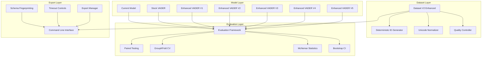

# Design Document

## Overview

The Enhanced Sentiment Analysis System builds upon the existing music industry sentiment analysis infrastructure to provide production-grade improvements including deterministic dataset generation, multiple VADER enhancement variants, comprehensive evaluation framework, and robust quality controls. The system maintains backward compatibility while introducing advanced features for research reproducibility and operational excellence.

## Architecture

### High-Level Architecture



### Integration with Existing System

The enhanced system integrates with the current codebase structure:

- **Existing**: `src/youtubeviz/advanced_music_sentiment.py` (current model)
- **Enhanced**: `datasets/music_industry_sentiment_dataset_v2_enhanced.py` (new dataset)
- **Evaluation**: `src/youtubeviz/sentiment_evaluation.py` (new evaluation framework)
- **VADER Variants**: `src/youtubeviz/vader_variants.py` (multiple enhancement approaches)

## Components and Interfaces

### 1. Enhanced Dataset Generator

**Purpose**: Create production-grade dataset with deterministic IDs and quality controls

**Key Classes**:
```python
class EnhancedMusicSentimentDatasetV2:
    """Production dataset with deterministic generation"""

    def __init__(self, schema_version: str = "2.1")
    def fingerprint(self) -> str
    def export_json_schema(self, path: str) -> None
    def get_train_test_split(self, test_size: float, random_state: int) -> Tuple[List, List]
    def _assert_quality(self) -> None

class DeterministicIDGenerator:
    """UUID-5 based ID generation for reproducibility"""

    def generate_id(self, phrase: str, sentiment: str, intent: str, aspect: str) -> str
    def validate_id_consistency(self, entries: List[MusicSlangEntry]) -> bool

class UnicodeNormalizer:
    """Unicode-aware text normalization for deduplication"""

    def normalize_for_key(self, text: str) -> str
    def handle_emoji_sequences(self, text: str) -> str
    def apply_nfkc_normalization(self, text: str) -> str
```

### 2. VADER Enhancement Variants

**Purpose**: Implement multiple enhancement approaches for comparative evaluation

**Variant Strategies**:

1. **Minimal Enhancement (V1)**: Conservative approach with only high-confidence additions
2. **Moderate Enhancement (V2)**: Balanced approach with curated slang and emoji
3. **Comprehensive Enhancement (V3)**: Full implementation from expert feedback
4. **Aggressive Enhancement (V4)**: Maximum customization with experimental weights
5. **Hybrid Enhancement (V5)**: Combination of rule-based and learned adjustments

**Key Classes**:
```python
class VADERVariantManager:
    """Manages multiple VADER enhancement variants"""

    def create_variant(self, variant_type: str) -> SentimentIntensityAnalyzer
    def get_all_variants(self) -> Dict[str, SentimentIntensityAnalyzer]
    def apply_music_domain_patches(self, analyzer: SentimentIntensityAnalyzer, variant: str) -> None

class MusicDomainLexicon:
    """Music-specific lexicon and booster management"""

    def get_slang_terms(self, variant: str) -> Dict[str, float]
    def get_emoji_weights(self, variant: str) -> Dict[str, float]
    def get_booster_terms(self, variant: str) -> Dict[str, float]
    def get_multi_word_idioms(self, variant: str) -> Dict[str, str]
```

### 3. Comprehensive Evaluation Framework

**Purpose**: Rigorous statistical evaluation with multiple testing approaches

**Key Classes**:
```python
class SentimentEvaluationFramework:
    """Multi-model evaluation with statistical rigor"""

    def run_paired_evaluation(self, models: Dict[str, Any], comments: List[str]) -> EvaluationResults
    def run_grouped_cv_evaluation(self, models: Dict[str, Any], data: pd.DataFrame) -> CVResults
    def compute_mcnemar_test(self, model_a_results: List[bool], model_b_results: List[bool]) -> McNemarResult
    def bootstrap_confidence_intervals(self, metric_deltas: List[float], confidence: float = 0.95) -> Tuple[float, float]

class YouTubeCommentFetcher:
    """Fetch comments for evaluation with proper API compliance"""

    def fetch_comments_by_video(self, video_ids: List[str], max_comments: int = 100) -> pd.DataFrame
    def apply_rate_limiting(self) -> None
    def log_api_parameters(self, query_params: Dict) -> None

class MultipleComparisonCorrection:
    """Handle multiple testing with FDR control"""

    def apply_benjamini_hochberg(self, p_values: List[float], alpha: float = 0.05) -> List[bool]
    def generate_slice_reports(self, results: Dict[str, EvaluationResults]) -> SliceReport
```

### 4. Production Pipeline Integration

**Purpose**: Integrate with existing ETL and analytics infrastructure

**Key Classes**:
```python
class SentimentPipelineIntegration:
    """Integration with existing sentiment analysis pipeline"""

    def replace_current_analyzer(self, best_variant: str) -> None
    def run_a_b_test(self, current_model: Any, enhanced_model: Any, duration_days: int) -> ABTestResults
    def update_notebook_dependencies(self, new_analyzer: Any) -> None

class BackwardCompatibilityManager:
    """Ensure existing code continues to work"""

    def create_compatibility_wrapper(self, enhanced_analyzer: Any) -> Any
    def migrate_existing_data(self, old_format: str, new_format: str) -> None
    def validate_api_consistency(self, old_api: Any, new_api: Any) -> bool
```

## Data Models

### Enhanced Dataset Entry

```python
@dataclass
class EnhancedMusicSlangEntry:
    """Enhanced entry with deterministic ID and validation"""

    # Core fields (unchanged for compatibility)
    phrase: str
    sentiment: SentimentLabel
    intent: Intent
    category: SlangCategory
    aspect: Aspect
    confidence: float

    # Enhanced fields
    id: str  # Deterministic UUID-5
    normalized_key: str  # For deduplication
    schema_version: str  # Version tracking
    created_timestamp: datetime  # Creation tracking

    # Metadata fields
    context_notes: str = ""
    beat_appreciation: bool = False
    gen_z_slang: bool = False
    toxicity: Toxicity = Toxicity.NONE
    nsfw: bool = False

    # Quality assurance
    validation_status: ValidationStatus = ValidationStatus.PENDING
    reviewer_notes: str = ""
```

### Evaluation Results Schema

```python
@dataclass
class EvaluationResults:
    """Comprehensive evaluation results"""

    # Model identification
    model_name: str
    variant_config: Dict[str, Any]
    evaluation_timestamp: datetime

    # Overall metrics
    accuracy: float
    precision: float
    recall: float
    f1_score: float
    macro_f1: float

    # Per-class metrics
    class_metrics: Dict[str, ClassMetrics]

    # Confidence intervals
    confidence_intervals: Dict[str, Tuple[float, float]]

    # Statistical tests
    mcnemar_results: Optional[McNemarResult]

    # Slice analysis
    slice_results: Dict[str, SliceMetrics]

    # Experiment metadata
    experiment_config: ExperimentConfig
    random_seed: int
    data_fingerprint: str
```

### VADER Variant Configuration

```python
@dataclass
class VADERVariantConfig:
    """Configuration for VADER enhancement variants"""

    variant_name: str
    variant_type: VariantType  # MINIMAL, MODERATE, COMPREHENSIVE, AGGRESSIVE, HYBRID

    # Lexicon modifications
    custom_lexicon: Dict[str, float]
    emoji_weights: Dict[str, float]
    booster_terms: Dict[str, float]
    multi_word_idioms: Dict[str, str]

    # Enhancement parameters
    booster_multiplier: float = 1.0
    threshold_adjustments: Dict[str, float] = field(default_factory=dict)

    # Metadata
    description: str
    rationale: str
    expected_improvements: List[str]
```

## Error Handling

### Dataset Quality Assurance

```python
class DatasetQualityError(Exception):
    """Raised when dataset quality checks fail"""
    pass

class DuplicationError(DatasetQualityError):
    """Raised when duplicate entries are detected"""
    pass

class InconsistentLabelingError(DatasetQualityError):
    """Raised when labeling inconsistencies are found"""
    pass

class ValidationError(DatasetQualityError):
    """Raised when entry validation fails"""
    pass
```

**Error Handling Strategy**:
- Fail fast with detailed error messages
- Provide specific examples of problematic entries
- Include suggestions for resolution
- Log all quality issues for analysis

### Evaluation Framework Errors

```python
class EvaluationError(Exception):
    """Base class for evaluation errors"""
    pass

class InsufficientDataError(EvaluationError):
    """Raised when insufficient data for evaluation"""
    pass

class ModelComparisonError(EvaluationError):
    """Raised when model comparison fails"""
    pass

class StatisticalTestError(EvaluationError):
    """Raised when statistical tests fail"""
    pass
```

**Error Recovery**:
- Graceful degradation when possible
- Alternative evaluation methods when primary fails
- Comprehensive logging for debugging
- User-friendly error messages with actionable guidance

## Testing Strategy

### Unit Testing

**Dataset Testing**:
- Deterministic ID generation consistency
- Unicode normalization correctness
- Quality control validation
- Schema compliance verification

**VADER Variant Testing**:
- Lexicon modification accuracy
- Booster term recognition
- Multi-word idiom handling
- Scoring consistency across variants

**Evaluation Framework Testing**:
- Statistical test implementations
- Confidence interval calculations
- Multiple comparison corrections
- Cross-validation fold generation

### Integration Testing

**End-to-End Pipeline Testing**:
- Dataset generation → Model training → Evaluation → Results
- API compatibility with existing systems
- Performance benchmarking
- Memory usage optimization

**YouTube API Integration Testing**:
- Comment fetching with rate limiting
- Data retention compliance
- Error handling for API failures
- Pagination and result consistency

### Performance Testing

**Scalability Testing**:
- Large dataset processing (10K+ entries)
- Multiple model evaluation efficiency
- Memory usage under load
- Concurrent evaluation handling

**Benchmark Testing**:
- Processing time comparisons
- Memory footprint analysis
- API response time measurement
- Statistical computation performance

### Validation Testing

**Scientific Rigor Testing**:
- Reproducibility verification (same inputs → same outputs)
- Statistical test correctness validation
- Cross-validation implementation verification
- Bias detection in evaluation methodology

**Domain Expert Validation**:
- Music industry terminology accuracy
- Cultural sensitivity verification
- Slang term appropriateness review
- Sentiment labeling consistency check

## Implementation Phases

### Phase 1: Enhanced Dataset Foundation
- Implement deterministic ID generation
- Add Unicode-aware normalization
- Create quality control framework
- Establish schema validation

### Phase 2: VADER Variant Development
- Develop 5 enhancement variants
- Implement lexicon management system
- Create variant configuration framework
- Add booster and idiom handling

### Phase 3: Evaluation Framework
- Build paired testing infrastructure
- Implement GroupKFold cross-validation
- Add statistical testing capabilities
- Create confidence interval calculations

### Phase 4: Integration and Validation
- Integrate with existing pipeline
- Conduct comprehensive testing
- Perform domain expert validation
- Optimize performance and memory usage

### Phase 5: Production Deployment
- Deploy best-performing variant
- Establish monitoring and alerting
- Create documentation and training
- Plan ongoing maintenance and updates
