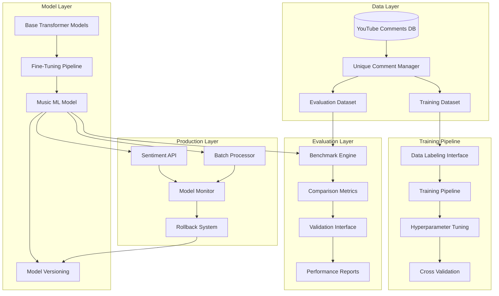

# Design Document

## Overview

The Music ML Sentiment Model system replaces the current VADER-based sentiment analysis with a modern transformer-based approach specifically fine-tuned for music industry YouTube comments. The system leverages existing infrastructure while introducing state-of-the-art NLP techniques to achieve significantly better accuracy on music domain language, slang, and cultural expressions.

## Architecture

### High-Level Architecture



### Integration with Existing System

The new system integrates seamlessly with current infrastructure:

- **Data Source**: Leverages existing `youtube_comments` table and `unique_comment_manager.py`
- **API Compatibility**: Maintains same interface as current sentiment functions
- **Pipeline Integration**: Works with existing ETL processes in `web/sentiment_job.py`
- **Analytics**: Compatible with current `youtubeviz` package and notebooks

## Components and Interfaces

### 1. Data Collection and Preprocessing

**Purpose**: Collect and prepare high-quality training data from unique music comments

**Key Classes**:
```python
class MusicCommentDataCollector:
    """Collect and filter music-related comments for training"""
    
    def __init__(self, unique_comment_manager: UniqueCommentManager)
    def fetch_music_comments(self, min_engagement: int = 5) -> pd.DataFrame
    def filter_by_music_channels(self, comments: pd.DataFrame) -> pd.DataFrame
    def stratify_by_artist_genre(self, comments: pd.DataFrame) -> pd.DataFrame
    def export_for_labeling(self, comments: pd.DataFrame, output_path: str) -> None

class CommentPreprocessor:
    """Clean and normalize comments for model training"""
    
    def normalize_text(self, text: str) -> str
    def handle_music_slang(self, text: str) -> str
    def preserve_emoji_context(self, text: str) -> str
    def tokenize_for_transformer(self, text: str) -> List[str]
```

### 2. Model Architecture and Training

**Purpose**: Implement transformer-based models fine-tuned for music domain

**Model Selection Strategy**:

1. **Base Model Candidates**:
   - `distilbert-base-uncased`: Fast inference, good performance
   - `roberta-base`: Better understanding of informal text
   - `cardiffnlp/twitter-roberta-base-sentiment-latest`: Pre-trained on social media
   - `j-hartmann/emotion-english-distilroberta-base`: Emotion understanding

2. **Fine-Tuning Approach**:
   - Domain adaptation on music comments
   - Task-specific fine-tuning for sentiment classification
   - Multi-task learning with emotion detection

**Key Classes**:
```python
class MusicSentimentModel:
    """Transformer-based sentiment model for music domain"""
    
    def __init__(self, base_model: str = "distilbert-base-uncased")
    def fine_tune(self, train_data: pd.DataFrame, val_data: pd.DataFrame) -> None
    def predict(self, texts: List[str]) -> List[Dict[str, float]]
    def predict_batch(self, texts: List[str], batch_size: int = 32) -> List[Dict[str, float]]
    def get_attention_weights(self, text: str) -> Dict[str, float]
    def explain_prediction(self, text: str) -> Dict[str, Any]

class ModelTrainer:
    """Handle model training pipeline with best practices"""
    
    def setup_training(self, config: TrainingConfig) -> None
    def train_with_validation(self, model: MusicSentimentModel, data: TrainingData) -> TrainingResults
    def hyperparameter_search(self, search_space: Dict[str, Any]) -> Dict[str, Any]
    def save_model_checkpoint(self, model: MusicSentimentModel, metrics: Dict[str, float]) -> str

class TrainingConfig:
    """Configuration for model training"""
    
    learning_rate: float = 2e-5
    batch_size: int = 16
    num_epochs: int = 3
    warmup_steps: int = 500
    weight_decay: float = 0.01
    max_length: int = 512
    gradient_accumulation_steps: int = 1
```

### 3. Evaluation and Benchmarking

**Purpose**: Comprehensive evaluation against existing models with statistical rigor

**Key Classes**:
```python
class SentimentBenchmark:
    """Compare multiple sentiment models on music comments"""
    
    def __init__(self, unique_comment_manager: UniqueCommentManager)
    def add_model(self, name: str, model: Any) -> None
    def run_evaluation(self, test_data: pd.DataFrame) -> BenchmarkResults
    def cross_validate(self, data: pd.DataFrame, cv_folds: int = 5) -> CVResults
    def statistical_significance_test(self, model_a: str, model_b: str) -> StatTestResults

class ModelComparator:
    """Detailed comparison between models"""
    
    def compare_on_slang_terms(self, models: Dict[str, Any], slang_examples: List[str]) -> SlangResults
    def compare_on_emoji_heavy(self, models: Dict[str, Any], emoji_comments: List[str]) -> EmojiResults
    def analyze_error_patterns(self, predictions: Dict[str, List], ground_truth: List) -> ErrorAnalysis
    def generate_confusion_matrices(self, predictions: Dict[str, List], ground_truth: List) -> Dict[str, np.ndarray]

class PerformanceMetrics:
    """Calculate comprehensive performance metrics"""
    
    def calculate_classification_metrics(self, y_true: List, y_pred: List) -> ClassificationMetrics
    def calculate_confidence_intervals(self, scores: List[float], confidence: float = 0.95) -> Tuple[float, float]
    def mcnemar_test(self, model_a_correct: List[bool], model_b_correct: List[bool]) -> McNemarResult
    def bootstrap_significance(self, scores_a: List[float], scores_b: List[float]) -> BootstrapResult
```

### 4. Production Integration

**Purpose**: Seamless integration with existing sentiment analysis pipeline

**Key Classes**:
```python
class ProductionSentimentAPI:
    """Production-ready API maintaining backward compatibility"""
    
    def __init__(self, model_path: str)
    def analyze_sentiment(self, text: str) -> Dict[str, float]  # Compatible with existing API
    def analyze_batch(self, texts: List[str]) -> List[Dict[str, float]]
    def get_model_info(self) -> Dict[str, Any]
    def health_check(self) -> Dict[str, Any]

class ModelDeployment:
    """Handle model deployment and versioning"""
    
    def deploy_model(self, model_path: str, version: str) -> None
    def rollback_to_version(self, version: str) -> None
    def a_b_test_models(self, model_a: str, model_b: str, traffic_split: float) -> None
    def monitor_performance(self) -> Dict[str, float]

class BackwardCompatibilityWrapper:
    """Ensure existing code continues to work"""
    
    def wrap_for_youtubeviz(self, ml_model: MusicSentimentModel) -> Any
    def migrate_existing_calls(self, old_function: str, new_function: str) -> None
    def validate_api_consistency(self) -> bool
```

## Data Models

### Training Data Schema

```python
@dataclass
class LabeledComment:
    """Individual labeled comment for training"""
    
    comment_id: str
    text: str
    normalized_text: str
    sentiment: SentimentLabel  # POSITIVE, NEGATIVE, NEUTRAL
    confidence: float
    labeler_id: str
    timestamp: datetime
    
    # Music-specific metadata
    artist_channel: Optional[str]
    video_id: Optional[str]
    contains_slang: bool
    slang_terms: List[str]
    emoji_count: int
    
    # Quality assurance
    validation_status: ValidationStatus
    inter_annotator_agreement: Optional[float]

@dataclass
class TrainingDataset:
    """Complete training dataset with metadata"""
    
    comments: List[LabeledComment]
    schema_version: str
    creation_timestamp: datetime
    train_test_split_seed: int
    
    # Statistics
    total_comments: int
    unique_comments: int
    sentiment_distribution: Dict[str, int]
    artist_distribution: Dict[str, int]
    
    # Quality metrics
    inter_annotator_agreement: float
    label_consistency_score: float
```

### Model Performance Schema

```python
@dataclass
class ModelPerformance:
    """Comprehensive model performance metrics"""
    
    model_name: str
    model_version: str
    evaluation_timestamp: datetime
    
    # Overall metrics
    accuracy: float
    precision: float
    recall: float
    f1_score: float
    macro_f1: float
    
    # Per-class metrics
    class_metrics: Dict[str, ClassificationMetrics]
    
    # Confidence intervals
    confidence_intervals: Dict[str, Tuple[float, float]]
    
    # Music-specific performance
    slang_accuracy: float
    emoji_accuracy: float
    cultural_expression_accuracy: float
    
    # Comparison with baselines
    improvement_over_vader: float
    improvement_over_textblob: float
    statistical_significance: Dict[str, float]

@dataclass
class BenchmarkResults:
    """Results from comparing multiple models"""
    
    models: Dict[str, ModelPerformance]
    best_model: str
    statistical_tests: Dict[str, StatTestResults]
    error_analysis: ErrorAnalysis
    recommendation: str
    confidence_level: float
```

### Music Domain Schema

```python
@dataclass
class MusicSlangTerm:
    """Music slang term with sentiment information"""
    
    term: str
    variants: List[str]  # Different spellings/forms
    sentiment_polarity: float  # -1 to 1
    confidence: float
    usage_frequency: int
    cultural_context: str
    examples: List[str]

@dataclass
class MusicDomainKnowledge:
    """Curated knowledge about music domain language"""
    
    slang_terms: List[MusicSlangTerm]
    emoji_mappings: Dict[str, float]
    cultural_expressions: Dict[str, str]
    intensifiers: List[str]
    negation_patterns: List[str]
    
    # Context-dependent terms
    genre_specific_terms: Dict[str, List[MusicSlangTerm]]
    generational_terms: Dict[str, List[MusicSlangTerm]]
```

## Error Handling

### Training Pipeline Errors

```python
class TrainingError(Exception):
    """Base class for training-related errors"""
    pass

class InsufficientDataError(TrainingError):
    """Raised when training data is insufficient"""
    pass

class ModelConvergenceError(TrainingError):
    """Raised when model fails to converge"""
    pass

class ValidationError(TrainingError):
    """Raised when validation fails"""
    pass
```

**Error Recovery Strategy**:
- Automatic data augmentation for insufficient data
- Hyperparameter adjustment for convergence issues
- Graceful degradation to simpler models when needed
- Comprehensive logging for debugging

### Production Errors

```python
class ProductionError(Exception):
    """Base class for production errors"""
    pass

class ModelLoadError(ProductionError):
    """Raised when model fails to load"""
    pass

class InferenceError(ProductionError):
    """Raised when inference fails"""
    pass

class PerformanceDegradationError(ProductionError):
    """Raised when model performance drops"""
    pass
```

**Error Recovery**:
- Automatic fallback to previous model version
- Circuit breaker pattern for inference failures
- Real-time performance monitoring with alerts
- Automatic rollback triggers

## Testing Strategy

### Unit Testing

**Model Testing**:
- Tokenization and preprocessing correctness
- Model architecture validation
- Prediction consistency and reproducibility
- Attention mechanism functionality

**Data Pipeline Testing**:
- Unique comment filtering accuracy
- Data preprocessing consistency
- Label validation and quality checks
- Train/test split integrity

### Integration Testing

**End-to-End Pipeline Testing**:
- Data collection → Training → Evaluation → Deployment
- API compatibility with existing systems
- Performance benchmarking against baselines
- Memory and inference time validation

**Production Integration Testing**:
- Backward compatibility verification
- Load testing with realistic comment volumes
- A/B testing framework validation
- Monitoring and alerting system tests

### Performance Testing

**Model Performance Testing**:
- Inference speed benchmarking (target: <100ms per comment)
- Memory usage optimization (target: <2GB for production model)
- Batch processing efficiency
- Concurrent request handling

**Accuracy Testing**:
- Cross-validation on held-out data
- Music slang term accuracy validation
- Emoji and cultural expression handling
- Edge case performance (very short/long comments)

### Domain Validation Testing

**Music Industry Validation**:
- Expert review of slang term handling
- Cultural sensitivity verification
- Genre-specific performance testing
- Generational language pattern validation

**Comparative Validation**:
- Head-to-head comparison with VADER variants
- Statistical significance testing
- Error pattern analysis
- Improvement quantification

## Implementation Phases

### Phase 1: Data Collection and Labeling
- Implement unique comment collection system
- Create data labeling interface and guidelines
- Build initial training dataset (5,000+ examples)
- Establish quality assurance processes

### Phase 2: Model Development and Training
- Implement transformer-based model architecture
- Create training pipeline with hyperparameter tuning
- Develop evaluation framework
- Train and validate initial models

### Phase 3: Comprehensive Evaluation
- Benchmark against existing models (VADER, TextBlob)
- Conduct statistical significance testing
- Analyze performance on music-specific language
- Generate detailed performance reports

### Phase 4: Production Integration
- Implement production API with backward compatibility
- Create deployment and versioning system
- Establish monitoring and alerting
- Conduct A/B testing with existing system

### Phase 5: Continuous Improvement
- Implement feedback collection system
- Create retraining pipeline
- Establish performance monitoring
- Plan regular model updates and improvements

## Performance Targets

### Accuracy Targets
- **Overall F1-Score**: >0.85 (vs current VADER ~0.65)
- **Music Slang Accuracy**: >0.90 for common terms
- **Emoji Interpretation**: >0.80 accuracy
- **Cultural Expression Handling**: >0.75 accuracy

### Performance Targets
- **Inference Time**: <100ms per comment
- **Batch Processing**: >1000 comments/minute
- **Memory Usage**: <2GB for production model
- **API Availability**: >99.9% uptime

### Business Impact Targets
- **Sentiment Analysis Accuracy**: 20%+ improvement over current system
- **False Positive Rate**: <10% for obvious sentiment cases
- **User Satisfaction**: Measurable improvement in sentiment analysis quality
- **Production Readiness**: Zero-downtime deployment capability