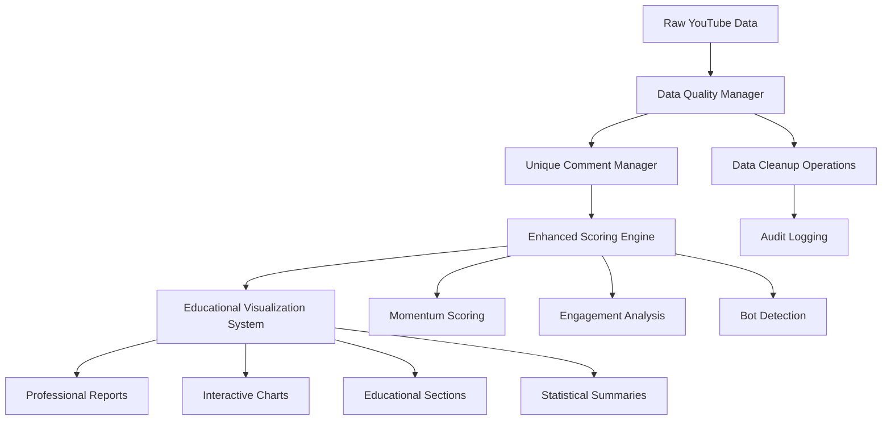

# Design Document

## Overview

The Professional ETL Analytics System is a comprehensive data pipeline that transforms raw YouTube data into actionable music industry insights. The system emphasizes data quality, educational value, and professional reporting while maintaining the fun and engaging nature that makes data science accessible to students and industry professionals alike.

## Architecture

### System Components



### Data Flow Architecture

1. **Ingestion Layer**: Raw YouTube data enters through existing ETL pipelines
2. **Quality Layer**: Automated data validation, cleanup, and deduplication
3. **Processing Layer**: Advanced scoring algorithms and sentiment analysis
4. **Presentation Layer**: Educational visualizations and professional reports
5. **Storage Layer**: Audit trails and performance tracking

## Components and Interfaces

### 1. Enhanced Data Quality Manager

**Purpose**: Automatically detect and resolve data quality issues while providing comprehensive reporting.

**Key Features**:
- Automated detection of missing video titles, artist names, comment text, and author information
- High-risk bot comment identification and educational display
- Well-formatted cleanup summaries with emojis and statistics
- Comprehensive audit logging for all cleanup operations

**Interface**:
```python
class EnhancedDataQualityManager:
    def validate_and_cleanup(self, engine) -> DataQualityReport
    def detect_missing_data(self, engine) -> List[DataIssue]
    def cleanup_invalid_records(self, engine) -> CleanupSummary
    def generate_quality_report(self, issues: List[DataIssue]) -> str
    def display_bot_samples(self, bot_comments: List[Comment]) -> str
```

### 2. Professional Scoring System

**Purpose**: Provide mathematically sound and interpretable scoring algorithms for music industry decision-making.

**Key Features**:
- Momentum scoring with confidence intervals and statistical significance
- Separate engagement metrics for likes vs comments with different weightings
- Artist name and video title integration instead of entity IDs
- Score validation to ensure results are within expected ranges

**Interface**:
```python
class ProfessionalScoringSystem:
    def calculate_momentum_scores(self, data: pd.DataFrame) -> ScoringResult
    def calculate_engagement_scores(self, data: pd.DataFrame) -> EngagementResult
    def validate_score_ranges(self, scores: pd.DataFrame) -> ValidationResult
    def enrich_with_metadata(self, scores: pd.DataFrame) -> pd.DataFrame
```

### 3. Educational Visualization Engine

**Purpose**: Create engaging, interactive visualizations that teach both technical skills and music industry concepts.

**Key Features**:
- Interactive charts with educational tooltips and explanations
- Category spectrum explanations with real-world context
- Emoji-enhanced formatting for visual appeal
- Separate analysis sections for different engagement types
- Mobile-friendly responsive design

**Interface**:
```python
class EducationalVisualizationEngine:
    def create_momentum_analysis_chart(self, data: pd.DataFrame) -> InteractiveChart
    def create_engagement_breakdown_chart(self, data: pd.DataFrame) -> InteractiveChart
    def generate_educational_section(self, topic: str) -> EducationalContent
    def format_professional_summary(self, results: Dict) -> FormattedReport
```

### 4. Unique Comment Management System

**Purpose**: Ensure data integrity by preventing duplicate comments from skewing analysis results.

**Key Features**:
- Global comment deduplication across all systems using real YouTube comments only
- Integration with existing unique comment helper functions
- Automatic detection and removal of any fake or synthetic data in tests
- Comprehensive tracking of real comment usage across different analysis contexts
- Enforcement of real data policy throughout the entire codebase

**Interface**:
```python
class UniqueCommentManager:
    def ensure_unique_comments(self, engine) -> DeduplicationResult
    def validate_test_data_authenticity(self, test_data: pd.DataFrame) -> ValidationResult
    def track_comment_usage(self, comments: List[str], context: str) -> None
```

## Data Models

### Enhanced Scoring Result
```python
@dataclass
class EnhancedScoringResult:
    entity_id: str
    entity_name: str  # Artist name or video title
    video_title: Optional[str]
    score_value: float
    confidence: float
    category: str
    statistical_significance: float
    metadata: Dict[str, Any]
```

### Data Quality Report
```python
@dataclass
class DataQualityReport:
    timestamp: datetime
    issues_detected: List[DataIssue]
    cleanup_summary: CleanupSummary
    bot_analysis: BotAnalysisResult
    quality_score: float
    recommendations: List[str]
```

### Educational Content
```python
@dataclass
class EducationalContent:
    title: str
    explanation: str
    examples: List[str]
    industry_context: str
    technical_notes: str
    interactive_elements: List[InteractiveElement]
```

## Error Handling

### Data Quality Errors
- **Missing Data Detection**: Automatically identify and flag incomplete records
- **Invalid Data Cleanup**: Remove or correct data that doesn't meet quality standards
- **Graceful Degradation**: Continue processing when non-critical issues are encountered
- **User Notification**: Provide clear, actionable error messages with suggested fixes

### Scoring Algorithm Errors
- **Range Validation**: Ensure all scores fall within expected mathematical bounds
- **Confidence Scoring**: Provide uncertainty measures for all calculated scores
- **Fallback Algorithms**: Use alternative scoring methods when primary algorithms fail
- **Statistical Validation**: Verify that score distributions make sense

### Visualization Errors
- **Data Availability**: Handle cases where insufficient data exists for certain charts
- **Responsive Design**: Ensure charts work across different screen sizes and devices
- **Performance Optimization**: Manage memory usage for large datasets
- **Accessibility**: Provide alternative text and keyboard navigation support

## Testing Strategy

### Unit Testing
- **Data Quality Functions**: Test each cleanup and validation function independently
- **Scoring Algorithms**: Verify mathematical correctness with known datasets
- **Visualization Components**: Test chart generation with various data scenarios
- **Comment Deduplication**: Ensure unique comment logic works correctly

### Integration Testing
- **End-to-End Pipeline**: Test complete data flow from ingestion to reporting
- **Database Operations**: Verify all upsert operations work correctly
- **Cross-System Communication**: Test integration between scoring and visualization systems
- **Performance Testing**: Ensure system handles production data volumes

### Data Quality Testing
- **Real Data Only**: All testing must use actual YouTube data-no fake or synthetic data allowed
- **Real Comment Analysis**: Bot detection and sentiment analysis tested with genuine user comments
- **Authentic Score Validation**: Scoring algorithms validated against real artist performance data
- **Production Data Scenarios**: Test with actual production data volumes and edge cases

### User Experience Testing
- **Educational Effectiveness**: Verify that explanations are clear and helpful
- **Visual Appeal**: Ensure charts and reports are engaging and professional
- **Mobile Compatibility**: Test all visualizations on different devices
- **Accessibility Compliance**: Verify screen reader and keyboard navigation support

## Implementation Phases

### Phase 1: Data Quality Foundation
1. Implement enhanced data quality manager
2. Integrate unique comment management system
3. Create comprehensive cleanup reporting
4. Add audit logging for all operations

### Phase 2: Professional Scoring System
1. Redesign momentum scoring algorithms
2. Implement separate engagement metrics
3. Add score validation and confidence measures
4. Integrate artist names and video titles

### Phase 3: Educational Visualization
1. Create interactive chart components
2. Develop educational content sections
3. Implement responsive design patterns
4. Add emoji-enhanced formatting

### Phase 4: System Integration
1. Connect all components into unified pipeline
2. Implement comprehensive error handling
3. Add performance monitoring and optimization
4. Create professional reporting templates

### Phase 5: Production Deployment
1. Comprehensive testing with real data
2. Performance optimization and tuning
3. Documentation and user training materials
4. Monitoring and alerting system setup
