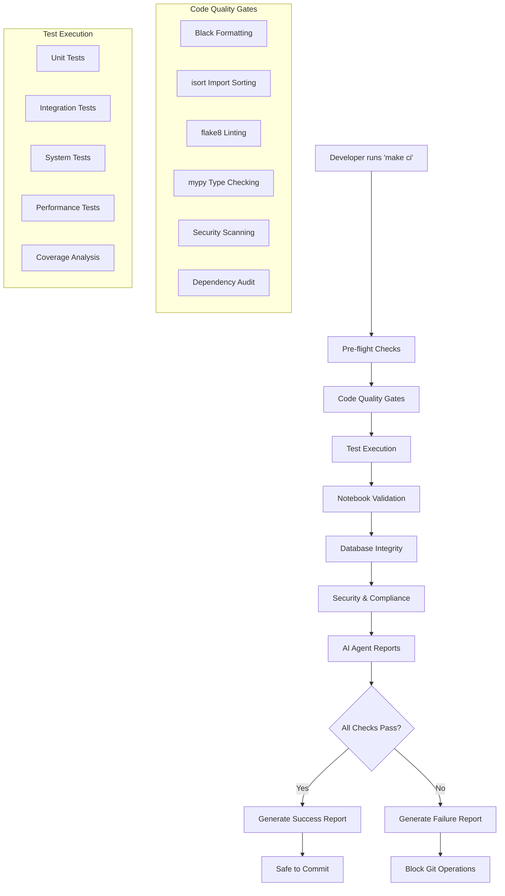
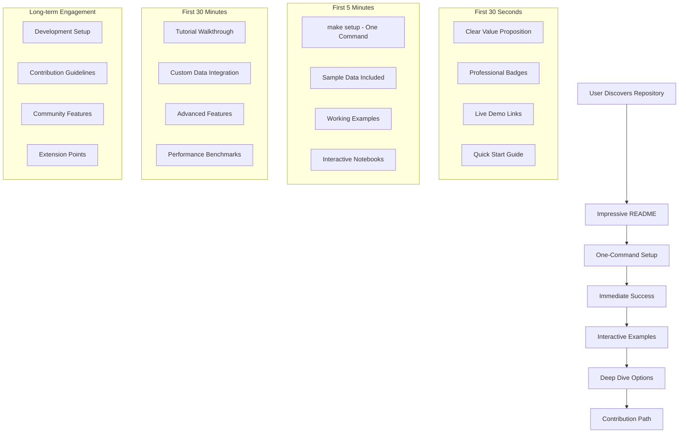
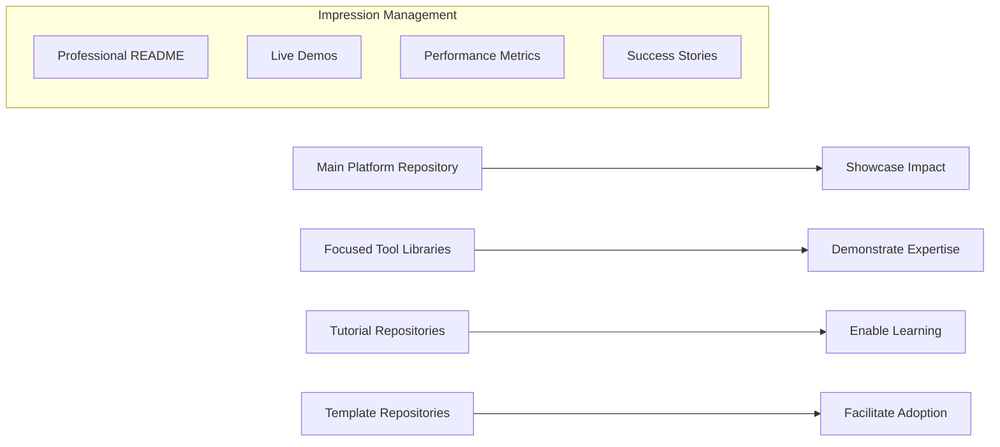

# Design Document

## Overview

This design creates a comprehensive CI/CD system and git repository strategy that maximizes the user experience for anyone discovering your work. The focus is on creating an impressive first impression, seamless onboarding, and clear demonstration of senior-level capabilities that make people want to fork, contribute, and hire you.

### User Journey Optimization

**Discovery → Setup → Success → Contribution**

1. **Discovery Phase**: Impressive README, clear value proposition, professional presentation
2. **Setup Phase**: One-command installation, sample data included, immediate results
3. **Success Phase**: Working examples, interactive tutorials, clear next steps
4. **Contribution Phase**: Easy development setup, clear guidelines, welcoming community

## Architecture

### CI/CD Pipeline Architecture



### User Experience Journey Architecture



### Repository Portfolio Strategy



## Personal Branding Strategy

### Unique Positioning: Music Industry + Data Science

**Core Brand Identity:**
- Grammy-nominated producer who codes
- Music industry insider with advanced data science training
- Bridge between creative and analytical worlds
- Real-world music business experience + technical excellence

**Differentiation from Other Data Scientists:**
- Actual music industry credibility and connections
- Understanding of music business metrics that matter
- Insights into artist development and A&R processes
- Knowledge of streaming economics and playlist dynamics

**Differentiation from Other Music Tech:**
- Rigorous data science methodology
- Production-grade engineering practices
- Academic research approach (M.S. program)
- Open source contribution and community building

### Repository Branding Elements

**Professional Identity Integration:**
```markdown
# YouTube Music Analytics Platform
*By Wilton Moore - Grammy-Nominated Producer & Data Scientist*

> "Combining 10+ years of music industry experience with advanced data science
> to unlock insights that matter to artists, labels, and music professionals."
```

**Credibility Indicators:**
- Grammy nomination details (year, category, project)
- M.S. Data Science program and university
- Music industry projects and collaborations
- Technical certifications and achievements

**Industry-Specific Value Propositions:**
- "Built by someone who understands both the creative and business sides of music"
- "Analytics that actually help with A&R decisions and artist development"
- "Insights from someone who's been in the studio and the boardroom"

### Content Strategy for Maximum Impact

**Technical + Industry Insights:**
- Blog posts combining music industry trends with data analysis
- Case studies of successful artist campaigns with data backing
- Tutorials that teach both technical skills and music business concepts
- Speaking opportunities at both tech and music industry conferences

**Sample Data and Examples:**
- Use artists and scenarios you understand professionally
- Include music industry context in all examples
- Explain why certain metrics matter to labels and artists
- Show ROI calculations that music executives care about

### Professional Network Leverage

**Music Industry Connections:**
- Testimonials from industry professionals you've worked with
- Case studies from real projects (with permission)
- Speaking at music industry conferences about data science
- Collaboration opportunities with labels and management companies

**Academic/Tech Connections:**
- Research collaborations with university professors
- Open source contributions to music technology projects
- Technical speaking at data science conferences
- Mentoring other music professionals learning data science

## User Experience Design

### First Impression Optimization (0-30 seconds)

**Repository Landing Page Strategy:**

1. **Hero Section with Industry Credibility**
   - Tagline: "Music Industry Analytics Platform by Grammy-Nominated Producer"
   - Subtitle: "Where Music Production Meets Data Science"
   - Credibility line: "Built by industry insider with M.S. Data Science"
   - Live demo with real music industry insights

2. **Unique Value Proposition**
   - "Analytics platform built by someone who understands both the music business and data science"
   - "Real industry insights, not just technical demos"
   - "Production-tested by Grammy-nominated music professional"

3. **Industry + Technical Credibility**
   - Grammy nomination badge/mention
   - M.S. Data Science program affiliation
   - Music industry experience
   - Technical excellence metrics (CI, coverage, performance)

### Onboarding Experience (0-5 minutes)

**Transparent Setup Process:**
```bash
# Clear, predictable setup with user control
make setup                    # Install dependencies and verify environment
make sample-data             # Load sample dataset (optional)
make dev                     # Development environment setup
make ci                      # Validate everything works

# Or combined for quick start:
make quickstart              # Runs setup + sample-data + validation
```

**What Users See:**
- Clear progress indicators for each step
- Explicit confirmation before data operations
- Validation results with specific metrics
- Option to skip or customize each phase
- Troubleshooting info if steps fail

### Learning Journey (5-30 minutes)

**Clear Technical Paths:**

1. **Use Existing Data**: `make run-examples`
   - Shows exactly which notebooks will execute
   - Displays expected runtime and resource usage
   - User can select specific examples to run

2. **Add Your Data**: `make configure-channels`
   - Prompts for API keys with clear instructions
   - Validates configuration before proceeding
   - Shows exactly what data will be collected

3. **Development Setup**: `make dev-environment`
   - Lists all tools that will be installed
   - Shows testing and linting configuration
   - Explains pre-commit hooks being added

### Development Environment (30+ minutes)

**Explicit Development Setup:**
```bash
make dev-setup              # Shows exactly what dev tools are installed
make test                   # Runs test suite with coverage report
make lint                   # Code quality checks with specific results
make ci                     # Full CI pipeline (same as used in GitHub)
```

**Technical Documentation:**
- Architecture decisions with rationale
- Performance characteristics and benchmarks
- Extension points with clear interfaces
- Contribution guidelines with technical standards

### Automation and Scheduled Tasks

**CRON Job Management:**
```bash
make setup-cron             # Shows cron schedule, asks for confirmation
make disable-cron           # Removes scheduled tasks
make cron-status            # Shows current scheduled tasks
```

**Expected Automation (User Should Know About):**
- Daily ETL runs (configurable time)
- Weekly data quality reports
- Monthly cleanup of old data (respects retention policies)
- Automatic dependency security updates (with notifications)

**User Control Points:**
- All schedules configurable via .env
- Easy enable/disable for all automation
- Clear logging of all automated actions
- Email/notification preferences for automated tasks

## Components and Interfaces

### Enhanced CI System (`make ci`)

**Primary Interface:**
```bash
make ci                    # Full CI pipeline
make ci-quick             # Essential checks only
make ci-fix               # Auto-fix issues where possible
make ci-report            # Generate detailed reports
```

**Core Components:**

1. **Pre-flight Validation**
   - Environment setup verification
   - Dependency consistency checks
   - Configuration validation
   - Git status assessment

2. **Code Quality Engine**
   - Advanced formatting with Black (120 char lines)
   - Import organization with isort
   - Comprehensive linting with flake8
   - Static type analysis with mypy
   - Security vulnerability scanning
   - Code complexity analysis

3. **Test Orchestration System**
   - Parallel test execution
   - Coverage reporting with thresholds
   - Performance benchmarking
   - Integration test validation
   - Notebook execution testing

4. **Database Integrity Validator**
   - Schema consistency checks
   - Referential integrity validation
   - Data quality assessments
   - Performance query analysis
   - Migration safety verification

5. **AI Agent Intelligence Layer**
   - System health reporting
   - Data quality metrics
   - Performance analytics
   - Failure pattern analysis
   - Recommendation engine

### Git Repository Management

**Git Setup Interface:**
```bash
make git-setup            # Configure GitHub remote
make git-status           # Analyze current state
make git-safety-commit    # Create rollback point
make git-prepare-release  # Prepare for public release
```

**Components:**

1. **Remote Configuration Manager**
   - GitHub repository creation assistance
   - SSH key setup and validation
   - Branch protection configuration
   - Webhook setup for CI/CD

2. **Commit History Analyzer**
   - Existing commit preservation
   - Commit message standardization
   - Branch strategy optimization
   - Release tagging automation

3. **Security Scanner**
   - Credential detection and removal
   - Sensitive data identification
   - API key protection
   - Privacy compliance validation

### Portfolio Architecture System

**Multi-Repository Strategy for Maximum Impact:**

1. **Main Platform Repository (`youtube-analytics-platform`)**
   ```
   ├── README.md                    # Impressive landing page
   ├── QUICKSTART.md               # 5-minute setup guide
   ├── docs/
   │   ├── ARCHITECTURE.md         # System design
   │   ├── API_REFERENCE.md        # Complete API docs
   │   └── DEPLOYMENT.md           # Production guide
   ├── examples/
   │   ├── sample_data/            # Pre-loaded datasets
   │   ├── notebooks/              # Interactive tutorials
   │   └── dashboards/             # Live demo dashboards
   ├── tools/                      # Production-ready tools
   └── tests/                      # Comprehensive test suite
   ```

2. **Focused Library (`youtube-etl-toolkit`)**
   - Standalone Python package
   - PyPI published library
   - Clear API documentation
   - Extensive examples

3. **Tutorial Repository (`youtube-analytics-tutorials`)**
   - Step-by-step learning path
   - Interactive Jupyter notebooks
   - Video walkthroughs
   - Community contributions

4. **Template Repository (`youtube-analytics-starter`)**
   - GitHub template repository
   - One-click project creation
   - Customizable configurations
   - Best practices included

**User Journey Optimization Per Repository:**

**Discovery Repository (Main Platform):**
- Impressive metrics and visualizations
- Live demo links
- Clear value proposition
- Professional presentation

**Learning Repository (Tutorials):**
- Progressive skill building
- Interactive examples
- Clear explanations
- Community support

**Adoption Repository (Starter Template):**
- Immediate productivity
- Customization guides
- Best practices
- Support resources

## Data Models

### CI Validation Results

```python
@dataclass
class CIValidationResult:
    """Comprehensive CI validation results for AI agent analysis."""

    # Overall status
    success: bool
    execution_time: float
    timestamp: datetime

    # Code quality metrics
    code_quality: CodeQualityMetrics
    test_results: TestExecutionResults
    notebook_validation: NotebookValidationResults
    database_integrity: DatabaseIntegrityResults

    # AI agent insights
    recommendations: List[str]
    risk_assessment: RiskLevel
    deployment_readiness: bool

@dataclass
class CodeQualityMetrics:
    """Code quality assessment results."""

    formatting_score: float  # 0-100
    linting_issues: int
    type_coverage: float     # 0-100
    security_vulnerabilities: int
    complexity_score: float  # 0-100
    documentation_coverage: float  # 0-100

@dataclass
class TestExecutionResults:
    """Comprehensive test execution analysis."""

    total_tests: int
    passed_tests: int
    failed_tests: int
    skipped_tests: int
    coverage_percentage: float
    performance_benchmarks: Dict[str, float]
    execution_time: float

@dataclass
class NotebookValidationResults:
    """Notebook execution and output validation."""

    notebooks_tested: int
    successful_executions: int
    failed_executions: int
    output_validation_results: Dict[str, bool]
    data_quality_checks: Dict[str, float]
    visualization_validation: Dict[str, bool]

@dataclass
class DatabaseIntegrityResults:
    """Database health and integrity assessment."""

    schema_consistency: bool
    referential_integrity: bool
    data_quality_score: float  # 0-100
    performance_metrics: Dict[str, float]
    record_counts: Dict[str, int]
    anomaly_detection: List[str]
```

### Repository Configuration

```python
@dataclass
class RepositoryStrategy:
    """Repository organization and deployment strategy."""

    # Repository structure
    primary_repository: str  # Main platform repository
    focused_tools: List[str]  # Individual tool repositories
    showcase_examples: List[str]  # Example/tutorial repositories

    # Content strategy
    public_components: List[str]
    private_components: List[str]
    sample_data_sets: List[str]

    # Documentation strategy
    readme_templates: Dict[str, str]
    api_documentation: bool
    tutorial_notebooks: List[str]
    deployment_guides: List[str]
```

## Error Handling

### CI Pipeline Error Management

1. **Graceful Degradation**
   - Continue execution when non-critical checks fail
   - Provide detailed failure context
   - Suggest specific remediation steps
   - Generate partial success reports

2. **Error Classification**
   - **Blocking Errors**: Prevent git operations (test failures, security issues)
   - **Warning Errors**: Allow commits with warnings (style issues, performance concerns)
   - **Info Errors**: Provide recommendations (optimization opportunities)

3. **Auto-Recovery Mechanisms**
   - Automatic code formatting fixes
   - Import organization corrections
   - Simple syntax error repairs
   - Configuration file updates

### Git Safety Mechanisms

1. **Pre-commit Validation**
   - Prevent commits with failing tests
   - Block sensitive data uploads
   - Validate commit message format
   - Ensure branch protection compliance

2. **Rollback Procedures**
   - Automatic rollback point creation
   - Safe reset mechanisms
   - Branch recovery procedures
   - Commit history preservation

## Testing Strategy

### Multi-Level Test Architecture

1. **Unit Tests** (Fast, Isolated)
   - Individual function validation
   - Mock-based testing
   - Edge case coverage
   - Performance unit tests

2. **Integration Tests** (Component Interaction)
   - Database integration testing
   - API integration validation
   - ETL pipeline testing
   - Notebook execution testing

3. **System Tests** (End-to-End)
   - Complete workflow validation
   - Data quality verification
   - Performance benchmarking
   - User scenario testing

4. **AI Agent Tests** (Intelligence Validation)
   - Report generation testing
   - Recommendation accuracy
   - Data interpretation validation
   - Decision support testing

### Test Data Management

1. **Sample Data Sets**
   - Anonymized production data
   - Synthetic test data
   - Edge case scenarios
   - Performance test data

2. **Test Environment Management**
   - Isolated test databases
   - Reproducible test environments
   - Parallel test execution
   - Resource cleanup automation

### Continuous Testing Integration

1. **Local Development Testing**
   - Pre-commit hook integration
   - IDE test integration
   - Real-time feedback
   - Performance monitoring

2. **CI/CD Pipeline Testing**
   - Automated test execution
   - Parallel test processing
   - Coverage reporting
   - Performance regression detection

## User Experience Maximization Strategy

### First Impression Checklist

**Visual Impact:**
- [ ] Professional README with hero image/GIF
- [ ] Live demo dashboard (hosted on GitHub Pages)
- [ ] Impressive metrics prominently displayed
- [ ] Clean, modern documentation design
- [ ] Professional badges and status indicators

**Immediate Value Demonstration:**
- [ ] Working example in under 2 minutes
- [ ] Sample data that tells interesting stories
- [ ] Interactive visualizations that wow users
- [ ] Clear before/after comparisons
- [ ] Performance benchmarks vs alternatives

**Trust and Credibility:**
- [ ] Comprehensive test coverage (>90%)
- [ ] Security scanning badges
- [ ] Production deployment examples
- [ ] Performance monitoring dashboards
- [ ] Community testimonials and case studies

### Onboarding Optimization

**Predictable Setup Flow:**
```bash
git clone https://github.com/wmoore012/youtube-analytics-platform
cd youtube-analytics-platform

# User chooses their path:
make setup                   # Basic setup, user controls next steps
make setup-with-samples     # Setup + sample data (asks for confirmation)
make setup-dev              # Full development environment

# Each step shows exactly what it's doing:
# ✓ Installing Python dependencies...
# ✓ Verifying database connection...
# ✓ Running schema migrations...
# ? Load sample data? (y/N)
```

**Technical Transparency:**
- Each command shows what it's executing
- Clear success/failure with specific error codes
- Log files location provided for debugging
- Option to run steps individually
- No hidden automation without user awareness

**Progressive Disclosure:**
1. **Level 1**: Basic usage (5 minutes)
2. **Level 2**: Customization (15 minutes)
3. **Level 3**: Advanced features (30 minutes)
4. **Level 4**: Development/contribution (60+ minutes)

### Engagement and Retention

**Interactive Learning:**
- Jupyter notebook tutorials with real data
- Interactive dashboards with sample insights
- Video walkthroughs for complex topics
- Community challenges and competitions

**Community Building:**
- GitHub Discussions for Q&A
- Contribution recognition system
- Mentorship program for new contributors
- Regular community calls/demos

**Continuous Value:**
- Regular updates with new features
- Performance improvements and optimizations
- New example analyses and use cases
- Integration with popular tools and platforms

### Conversion Optimization (Hiring/Collaboration)

**Professional Demonstration:**
- Architecture decision documentation
- Performance optimization case studies
- Scalability planning and implementation
- Production incident response examples

**Technical Leadership Evidence:**
- Code review examples and standards
- Mentoring documentation and examples
- Technical writing and documentation
- Open source community contributions

**Business Impact Showcase:**
- ROI calculations and business metrics
- User success stories and testimonials
- Performance improvements and cost savings
- Adoption metrics and growth trends

## Implementation Phases

### Phase 1: Enhanced CI System
- Upgrade existing `make ci` command
- Implement comprehensive validation
- Add AI agent reporting
- Create rollback safety mechanisms

### Phase 2: Git Repository Setup
- Configure GitHub remote connection
- Preserve existing commit history
- Implement security scanning
- Create initial public repository

### Phase 3: Portfolio Architecture
- Design repository organization strategy
- Create focused tool repositories
- Develop showcase examples
- Implement documentation framework

### Phase 4: Advanced Capabilities
- Add performance monitoring
- Implement advanced analytics
- Create operational dashboards
- Develop contribution guidelines

This design ensures both immediate needs (robust CI, git setup) and long-term goals (senior-level portfolio demonstration) are addressed through a comprehensive, scalable architecture.
