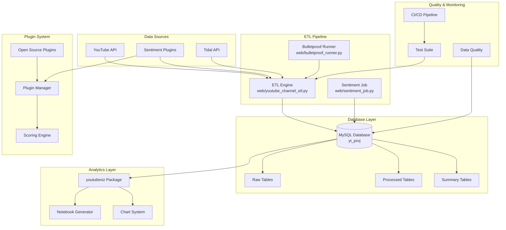

# Design Document

## Overview

This design consolidates the existing YouTube ETL and analytics system into a production-ready platform with clean architecture, comprehensive plugin integration, and verified data pipeline operation. The system transforms from a feature-rich but fragmented codebase into a maintainable, standards-compliant production system.

## Architecture

### High-Level System Architecture



### Data Flow Architecture

1. **Extraction**: YouTube/Spotify/Tidal APIs → Raw JSON storage
2. **Processing**: Raw data → Normalized tables with validation
3. **Enhancement**: Sentiment analysis, bot detection, scoring plugins
4. **Analytics**: Processed data → Interactive notebooks and dashboards
5. **Quality**: Continuous monitoring and validation

## Components and Interfaces

### 1. ETL Engine (`web/` directory)

**Core Components:**
- `youtube_channel_etl.py`: Main ETL pipeline with rate limiting
- `sentiment_job.py`: Sentiment analysis processing
- `bulletproof_runner.py`: Fault-tolerant execution framework
- `etl_helpers.py`: Database utilities and normalization functions
- `models.py`: Pydantic models for data validation

**Key Interfaces:**
```python
class YouTubeChannelETL:
    def run_for_channel(self, channel_url: str, limit: Optional[int] = None) -> ETLSummary
    def extract_videos(self, channel_id: str) -> List[Dict]
    def process_metrics(self, video_data: List[Dict]) -> int
    def extract_comments(self, video_ids: List[str]) -> int

class YouTubeCommentSentimentJob:
    def score_batch(self, limit: int = 500) -> SentimentStats
    def refresh_summary(self) -> int
    def snapshot_daily_sentiment(self) -> int
```

### 2. Plugin System (`src/data_organization/`)

**Architecture:**
- Plugin Manager: Discovery, loading, validation
- Scoring Engine: Execution with isolation and monitoring
- Open Source Framework: Community plugin support
- Storage System: Results persistence and history

**Key Interfaces:**
```python
class ScoringPlugin(ABC):
    @abstractmethod
    def get_name(self) -> str
    @abstractmethod
    def calculate_scores(self, data: pd.DataFrame) -> pd.DataFrame
    @abstractmethod
    def validate_input(self, data: pd.DataFrame) -> ValidationResult

class PluginManager:
    def discover_plugins(self, search_paths: List[str]) -> List[str]
    def load_plugin(self, plugin_class_path: str) -> None
    def get_plugin_instance(self, plugin_name: str) -> ScoringPlugin

class ScoringEngine:
    def execute_scoring(self, algorithm_name: str, data: pd.DataFrame) -> ScoringResult
    def register_plugin(self, plugin: ScoringPlugin) -> None
```

### 3. Analytics Package (`src/youtubeviz/`)

**Modular Design:**
- Core utilities: Data filtering, artist management
- Chart system: Interactive Plotly/Altair visualizations
- ML analytics: Advanced sentiment and predictive models
- Bulletproof execution: Timeout protection and error handling

**Key Interfaces:**
```python
# Core utilities
def filter_artists(df: pd.DataFrame, artists: List[str]) -> pd.DataFrame
def safe_head(df: pd.DataFrame, n: int = 5) -> pd.DataFrame

# Chart system
def views_over_time_plotly(df: pd.DataFrame) -> plotly.graph_objects.Figure
def artist_compare_altair(df: pd.DataFrame) -> alt.Chart

# Bulletproof execution
@bulletproof_chart(timeout=5)
def create_chart(data: pd.DataFrame) -> Optional[plotly.graph_objects.Figure]
```

### 4. Database Schema

**Normalized Design (3NF):**
- Natural keys preferred over artificial keys
- Proper foreign key relationships
- Optimized indexes for common queries
- lowercase_snake_case naming throughout

**Core Tables:**
```sql
-- Raw data storage
youtube_videos_raw (video_id, raw_data, extracted_at)
youtube_comments_raw (comment_id, video_id, raw_data, extracted_at)

-- Processed data
youtube_videos (video_id, title, channel_id, published_at, view_count, ...)
youtube_comments (comment_id, video_id, author_name, comment_text, ...)
youtube_metrics (video_id, metric_date, view_count, like_count, ...)

-- Enhanced data
comment_sentiment (comment_id, sentiment_score, confidence_score, method)
comment_bot_analysis (comment_id, bot_score, risk_level, analyzed_at)
artist_performance_summary (artist_name, total_videos, avg_sentiment, ...)

-- Plugin system
scoring_runs (run_id, algorithm_name, entity_type, executed_at, ...)
scoring_results (run_id, entity_id, score_value, score_type, ...)
```

## Data Models

### ETL Data Models

```python
class YouTubeVideo(BaseModel):
    video_id: str = Field(..., pattern=r"^[a-zA-Z0-9_-]{11}$")
    title: str = Field(..., min_length=1, max_length=500)
    channel_id: str = Field(..., pattern=r"^UC[a-zA-Z0-9_-]{22}$")
    published_at: datetime
    view_count: int = Field(0, ge=0)
    like_count: int = Field(0, ge=0)
    comment_count: int = Field(0, ge=0)

class SentimentResult(BaseModel):
    comment_id: str
    sentiment_score: float = Field(..., ge=-1.0, le=1.0)
    confidence_score: float = Field(..., ge=0.0, le=1.0)
    method: SentimentMethod
```

### Plugin Data Models

```python
class PluginMetadata(BaseModel):
    name: str
    version: str
    author: str
    description: str
    parameters: Dict[str, Any]
    input_requirements: List[str]
    output_schema: Dict[str, str]
    tags: List[str]

class ScoringResult(BaseModel):
    algorithm_name: str
    entity_type: str
    scores: pd.DataFrame
    metadata: Dict[str, Any]
    execution_time: float
    success: bool
```

## Error Handling

### Fail-Fast Philosophy

**Database Operations:**
- Strict validation with Pydantic models
- Foreign key constraints enforced
- Transaction rollback on any error
- Clear error messages with context

**ETL Pipeline:**
- Rate limit handling with exponential backoff
- API error classification and retry logic
- Data quality validation at each stage
- Comprehensive logging with structured data

**Plugin System:**
- Input validation before execution
- Execution timeouts and memory limits
- Sandboxed execution environment
- Detailed error reporting with stack traces

### Error Recovery Strategies

```python
class ETLError(Exception):
    """Base ETL error with context."""
    def __init__(self, message: str, context: Dict[str, Any] = None):
        super().__init__(message)
        self.context = context or {}

class YouTubeAPIError(ETLError):
    """YouTube API specific errors with retry logic."""
    def __init__(self, message: str, status_code: int, retry_after: Optional[int] = None):
        super().__init__(message, {"status_code": status_code, "retry_after": retry_after})
        self.status_code = status_code
        self.retry_after = retry_after

# Usage example
try:
    videos = etl.extract_videos(channel_id)
except YouTubeAPIError as e:
    if e.status_code == 403:  # Quota exceeded
        logger.error(f"API quota exceeded, retry after {e.retry_after} seconds")
        raise ETLError("Daily quota exceeded, schedule retry", e.context)
    else:
        raise ETLError(f"API error: {e}", e.context)
```

## Testing Strategy

### Test-Driven Development (TDD)

**Test Categories:**
1. **Unit Tests**: Individual functions and classes
2. **Integration Tests**: Database operations and API calls
3. **System Tests**: End-to-end pipeline execution
4. **Performance Tests**: Load testing and benchmarking
5. **Quality Tests**: Code style and standards compliance

**Test Structure:**
```python
# Unit test example
class TestYouTubeETL:
    def test_normalize_video_data_valid_input(self):
        """Test video normalization with valid data."""
        raw_data = {...}  # Valid YouTube API response
        result = normalize_youtube_video(raw_data)
        assert isinstance(result, YouTubeVideo)
        assert result.video_id == "dQw4w9WgXcQ"

    def test_normalize_video_data_invalid_video_id(self):
        """Test video normalization fails with invalid video ID."""
        raw_data = {"id": "invalid_id", ...}
        with pytest.raises(ValidationError):
            normalize_youtube_video(raw_data)

# Integration test example
class TestETLIntegration:
    def test_full_channel_processing(self, test_db):
        """Test complete channel processing pipeline."""
        etl = YouTubeChannelETL(...)
        summary = etl.run_for_channel("https://youtube.com/@test")

        assert summary.videos_seen > 0
        assert summary.raw_upserts > 0
        assert len(summary.errors) == 0

        # Verify data in database
        videos = test_db.execute("SELECT COUNT(*) FROM youtube_videos").scalar()
        assert videos > 0
```

### Quality Assurance Pipeline

**Pre-commit Hooks:**
- Black formatting (120 character line length)
- isort import sorting (black profile)
- flake8 linting with custom rules
- mypy type checking
- pytest execution with coverage

**CI/CD Pipeline:**
```yaml
# .github/workflows/quality.yml
name: Quality Assurance
on: [push, pull_request]
jobs:
  quality:
    runs-on: ubuntu-latest
    steps:
      - uses: actions/checkout@v3
      - name: Set up Python
        uses: actions/setup-python@v4
        with:
          python-version: '3.11'
      - name: Install dependencies
        run: |
          pip install -r requirements-dev.txt
          pip install -e .
      - name: Run quality checks
        run: |
          black --check --line-length=120 .
          isort --check-only --profile black .
          flake8 --max-line-length=120
          mypy src/ web/
      - name: Run tests
        run: |
          pytest --cov=src --cov=web --cov-report=xml
      - name: Upload coverage
        uses: codecov/codecov-action@v3
```

## Implementation Plan Integration

### Phase 1: System Consolidation
- Clean up redundant code and extract helpers
- Standardize naming conventions (lowercase_snake_case)
- Implement comprehensive error handling
- Remove all fake data and replace with real data access

### Phase 2: Plugin Integration
- Integrate all open source plugins into main system
- Implement plugin discovery and loading mechanisms
- Add scoring engine with isolation and monitoring
- Create plugin validation and security framework

### Phase 3: Database Optimization
- Normalize database schema to 3NF
- Implement proper indexing strategy
- Add foreign key constraints
- Optimize query performance

### Phase 4: Quality Implementation
- Set up comprehensive test suite
- Implement CI/CD pipeline
- Add code quality tools and pre-commit hooks
- Create monitoring and alerting system

### Phase 5: Production Deployment
- Implement configuration management
- Add health checks and monitoring
- Create deployment automation
- Establish backup and recovery procedures

This design provides a comprehensive blueprint for transforming the existing system into a production-ready, maintainable platform while preserving all existing functionality and adding robust plugin capabilities.
