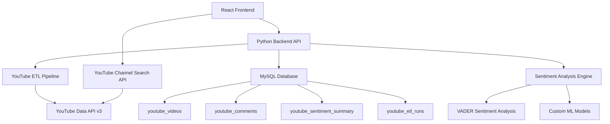

# YT DataScope™ Frontend Design Document

## Overview

YT DataScope™ is a professional web application that transforms the existing YouTube ETL & Sentiment Analysis Platform into an accessible, interactive dashboard for music industry professionals. The frontend serves as the primary interface to comprehensive YouTube analytics with advanced sentiment analysis capabilities, offering competitive analysis tools and artist momentum tracking.

The application addresses the critical user need for YouTube channel discovery and management, as evidenced by the complex channel ID requirements in the .env configuration. Users need an intuitive way to search, add, and manage YouTube channels without dealing with the technical complexity of channel ID resolution.

## Architecture

### Technology Stack
- **Frontend Framework**: React 18 with TypeScript for type safety
- **Styling**: Tailwind CSS for responsive, mobile-first design
- **Charts/Visualization**: Plotly.js for interactive charts (matching existing notebook outputs)
- **State Management**: Zustand for lightweight, scalable state management
- **API Communication**: React Query + Axios for efficient data fetching and caching
- **Authentication**: JWT-based authentication (future: Supabase OAuth)
- **Database**: MySQL (current) → Supabase (future migration path)
- **Deployment**: Vercel for frontend, existing Python backend infrastructure

### System Architecture



## Components and Interfaces

### Core Application Structure

#### 1. Layout Components
- **AppHeader**: Navigation, YouTube connection status, user profile
- **Sidebar**: Artist management, filters, time controls, cross-app promotion
- **MainDashboard**: Dynamic chart grid based on user selection
- **Footer**: LinkedIn connection (linkedin.com/in/wiltonmoore), ecosystem links

#### 2. Artist Management System
**Critical Feature**: Addresses the channel ID complexity mentioned in requirements

- **YouTubeChannelSearch**: 
  - Real-time search with YouTube Data API
  - Handles channel URL vs channel ID resolution
  - Preview channel information before adding
  - Validates channel accessibility and data availability

- **ArtistConfigurationPanel**:
  - Add/remove artists from tracking
  - Bulk import from .env YT_CHANNEL_* variables
  - Channel health monitoring (API accessibility, data freshness)
  - Artist color scheme management

- **ChannelDiscovery**:
  - Search by channel name, URL, or handle (@username)
  - Automatic resolution of different YouTube URL formats
  - Channel verification and metadata preview
  - Duplicate detection and merge suggestions

#### 3. Professional Chart Dashboard
Based on the MusicScope™ Professional Dashboard notebook, implementing all 20 charts:

**Sentiment Analysis Section (Charts 1-5)**:
- `DivergingSentimentBars`: Artist sentiment comparison
- `SentimentClusterHeatmap`: Comment sentiment patterns
- `PositiveThemeLollipops`: Top positive sentiment themes
- `NegativeThemeLollipops`: Areas needing attention
- `PolarityRidgelines`: Sentiment distribution analysis

**Performance Analysis Section (Charts 6-10)**:
- `StandoutVideosScatter`: High-performing content identification
- `RosterRankBumpChart`: Artist ranking changes over time
- `ViewsByCategoryAreas`: Content category performance
- `ContentTypeDots`: Video format effectiveness
- `GenreContextHeatmap`: Competitive positioning

**Content Strategy Section (Charts 11-15)**:
- `IsrcBalanceBars`: Content catalog analysis
- `ContentLengthDumbbells`: Optimal video length insights
- `UpsetFeatureIntersections`: Content feature combinations
- `TourCompatibilityAnalysis`: Live performance correlation
- `AbTestFramework`: Content experiment tracking

**Advanced Analytics Section (Charts 16-20)**:
- `UmapClusteringChart`: Artist similarity mapping
- `UpsetPlot`: Feature intersection analysis
- `IsrcBalanceChart`: Catalog distribution
- `ArtistCompareAltair`: Multi-artist comparison
- `ViewsOverTimePlotly`: Temporal performance trends

#### 4. Data Management Components

- **YouTubeConnectionManager**:
  - OAuth flow for YouTube API access
  - API quota monitoring and usage alerts
  - Connection health status and troubleshooting

- **ETLStatusDashboard**:
  - Real-time pipeline status monitoring
  - Data freshness indicators
  - ETL run history and error logs
  - Manual ETL trigger capabilities

- **DataExportManager**:
  - Multi-format export (CSV, JSON, PDF reports)
  - Scheduled report generation
  - Executive presentation templates
  - Custom date range selection

## Data Models

### Frontend Data Structures

```typescript
interface Artist {
  id: string;
  name: string;
  channelId: string;
  channelUrl: string;
  channelHandle?: string; // @username format
  isActive: boolean;
  lastUpdated: Date;
  metrics: ArtistMetrics;
  colorScheme: string;
  dataQuality: DataQualityStatus;
}

interface ArtistMetrics {
  totalViews: number;
  totalVideos: number;
  totalComments: number;
  avgSentiment: number;
  momentumScore: number;
  growthRate: number;
  engagementRate: number;
  lastVideoDate: Date;
}

interface ChartConfiguration {
  id: ChartType;
  title: string;
  description: string;
  dataRequirements: string[];
  isEnabled: boolean;
  position: { row: number; col: number };
  size: { width: number; height: number };
}

interface DashboardState {
  selectedArtists: Artist[];
  timeRange: TimeRange;
  activeCharts: ChartType[];
  filters: FilterConfiguration;
  viewMode: 'grid' | 'focus' | 'mobile';
}

interface YouTubeChannelSearchResult {
  channelId: string;
  title: string;
  description: string;
  thumbnailUrl: string;
  subscriberCount: number;
  videoCount: number;
  customUrl?: string;
  handle?: string;
  isVerified: boolean;
}
```

### API Integration Interfaces

```typescript
interface ChartDataRequest {
  artistIds: string[];
  chartType: ChartType;
  timeRange: TimeRange;
  filters?: Record<string, any>;
  aggregation?: 'daily' | 'weekly' | 'monthly';
}

interface YouTubeSearchRequest {
  query: string;
  type: 'channel' | 'video';
  maxResults: number;
  regionCode?: string;
}

interface ETLStatusResponse {
  isRunning: boolean;
  lastRunTime: Date;
  nextScheduledRun: Date;
  dataFreshness: Record<string, Date>;
  errors: ETLError[];
  quotaUsage: QuotaStatus;
}
```

## Error Handling

### Robust Error Management
Following the bulletproof execution patterns from the existing codebase:

#### Chart Error Boundaries
- **Individual Chart Protection**: Each chart wrapped in error boundary
- **Graceful Degradation**: Show placeholder with retry option
- **Error Reporting**: Log chart failures for debugging
- **Fallback Visualizations**: Simple charts when complex ones fail

#### YouTube API Error Handling
- **Quota Exceeded**: Clear user messaging with next reset time
- **Channel Not Found**: Helpful suggestions for channel discovery
- **Permission Denied**: Guide users through OAuth re-authorization
- **Rate Limiting**: Automatic retry with exponential backoff

#### Data Quality Safeguards
- **Missing Data Indicators**: Clear visual indicators for incomplete data
- **Stale Data Warnings**: Alerts when data exceeds freshness thresholds
- **Validation Feedback**: Real-time validation for channel URLs and IDs
- **Conflict Resolution**: Handle duplicate or conflicting channel data

## Testing Strategy

### Comprehensive Testing Approach

#### Unit Testing
- **Component Testing**: React Testing Library for all UI components
- **Chart Testing**: Mock Plotly interactions and verify data rendering
- **State Management**: Test Zustand stores and state transitions
- **Utility Functions**: Test YouTube URL parsing and channel ID resolution

#### Integration Testing
- **API Integration**: Mock backend responses and test error scenarios
- **Chart Data Flow**: Verify data transformation from API to visualization
- **User Workflows**: Test complete user journeys from search to dashboard

#### End-to-End Testing
- **Cypress Tests**: Critical user paths including artist management
- **Visual Regression**: Ensure chart consistency across updates
- **Performance Testing**: Monitor loading times and memory usage
- **Mobile Testing**: Touch interactions and responsive behavior

## User Experience Design

### Mobile-First Responsive Design
Addressing Requirement 8 for mobile optimization:

#### Responsive Chart Strategy
- **Adaptive Layouts**: Charts reflow based on screen size
- **Touch Interactions**: Optimized for mobile chart exploration
- **Progressive Disclosure**: Show summary on mobile, details on desktop
- **Offline Capability**: Cache recent data for offline viewing

#### Navigation Patterns
- **Bottom Navigation**: Mobile-friendly primary navigation
- **Swipe Gestures**: Navigate between chart sections
- **Quick Actions**: Floating action button for common tasks
- **Search-First**: Prominent search for artist discovery

### Accessibility & Usability
Following Steve Krug's "Don't Make Me Think" principles:

#### Clear User Interface
- **Simple Language**: Avoid technical jargon in user-facing text
- **Visual Hierarchy**: Clear information architecture
- **Consistent Patterns**: Reusable interaction patterns
- **Immediate Feedback**: Real-time response to user actions

#### Professional User Experience
- **Executive Dashboard Mode**: High-level KPIs for stakeholders
- **Analyst Deep-Dive Mode**: Detailed data exploration tools
- **Quick Insights**: AI-generated insights and recommendations
- **Customizable Views**: Save and share dashboard configurations

## Security Considerations

### Authentication & Authorization
- **JWT-Based Auth**: Secure token management with refresh tokens
- **Role-Based Access**: Artist, Label, Admin permission levels
- **Session Security**: Automatic logout and secure token storage
- **API Key Protection**: Never expose YouTube API keys in frontend

### Data Protection
- **Input Sanitization**: Prevent XSS attacks on all user inputs
- **CORS Configuration**: Proper cross-origin request handling
- **Sensitive Data**: No client-side storage of API credentials
- **Privacy Compliance**: GDPR-compliant data handling

### YouTube API Compliance
- **Data Retention**: Automatic cleanup per YouTube ToS requirements
- **Usage Monitoring**: Track and limit API usage per user
- **Terms Compliance**: Ensure all features comply with YouTube API ToS
- **User Consent**: Clear disclosure of data usage and retention

## Performance Optimization

### Loading & Caching Strategy
- **React Query**: Intelligent caching and background updates
- **Chart Lazy Loading**: Load charts as they enter viewport
- **Data Prefetching**: Anticipate user navigation patterns
- **Progressive Enhancement**: Core functionality without JavaScript

### Bundle Optimization
- **Code Splitting**: Route-based and feature-based splitting
- **Tree Shaking**: Remove unused Plotly chart types
- **Asset Optimization**: Optimize images and minimize bundle size
- **CDN Integration**: Serve static assets from CDN

### Real-Time Features
- **WebSocket Integration**: Live ETL status updates
- **Optimistic Updates**: Immediate UI feedback for user actions
- **Background Sync**: Update data without blocking user interaction
- **Smart Polling**: Efficient data refresh strategies

## Implementation Phases

### Phase 1: Core Dashboard (MVP-4 weeks)
**Goal**: Functional dashboard with essential features

- YouTube channel search and artist management
- Top 10 most critical charts from the notebook
- Basic responsive design for mobile and desktop
- YouTube API integration with error handling
- Simple data export functionality

**Key Features**:
- Artist search and configuration
- Sentiment analysis charts (1-5)
- Performance analysis charts (6-10)
- Mobile-responsive layout
- Basic ETL status monitoring

### Phase 2: Complete Analytics Suite (6 weeks)
**Goal**: Full feature parity with notebook dashboard

- All 20 professional charts implemented
- Advanced filtering and time range controls
- Comprehensive data export options
- Performance optimizations for large datasets
- Enhanced mobile experience

**Key Features**:
- Content strategy charts (11-15)
- Advanced analytics charts (16-20)
- Custom date ranges and filters
- PDF report generation
- Chart customization options

### Phase 3: Professional Platform (8 weeks)
**Goal**: Enterprise-ready platform with advanced features

- Multi-user support with role-based access
- Advanced reporting and scheduled exports
- API access for external integrations
- Enhanced security and compliance features
- Cross-app integration preparation

**Key Features**:
- User management and permissions
- Scheduled report delivery
- API documentation and access
- Advanced security features
- Integration with the ecosystem

### Phase 4: Platform Evolution (Ongoing)
**Goal**: Continuous improvement and ecosystem integration

- Supabase migration for real-time features
- OAuth implementation for seamless authentication
- SDK development for third-party integrations
- AI-powered insights and recommendations
- Advanced competitive analysis features

**Key Features**:
- Real-time data updates
- AI-generated insights
- Competitive benchmarking
- Advanced export formats
- Third-party integrations

## Cross-Platform Integration

### Ecosystem Integration
Addressing Requirement 11 for cross-promotion:

#### Shared User Experience
- **Single Sign-On**: Seamless authentication across apps
- **Shared Data**: Common artist and analytics data
- **Consistent Design**: Unified design language across platforms
- **Cross-Navigation**: Easy movement between applications

#### App-Specific Features
- **Music App**: Direct integration for music discovery insights
- **CatalogLAB**: Catalog analysis and optimization tools
- **LinkedIn Integration**: Professional networking and sharing
- **GitHub Showcase**: Technical implementation transparency

This design provides a comprehensive foundation for building YT DataScope™ as a professional, scalable, and user-friendly platform that addresses all requirements while maintaining technical excellence and user experience standards.