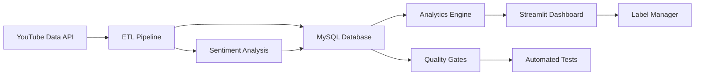

# 🎵 MusicScope™ – YouTube Analytics for A&R Intelligence
### Data-driven insights for music industry decision-making

[](https://streamlit.io/)


> **TL;DR:** Production-grade YouTube analytics platform that helps music labels decide **which artist to promote next**. Automates ETL into MySQL, runs QA tests, and surfaces momentum + engagement insights in a Streamlit app that is easy for non-technical stakeholders to use.

---

## 📊 Impact at a Glance

| 🎯 Metric           | Value            | Context                          |
|---------------------|------------------|----------------------------------|
| **Artists tracked** | 6                | Same label, similar signing time |
| **Videos analyzed** | 800+             | 260M+ total views                |
| **Time-series rows**| 50K+             | Daily tracking since signing     |
| **Comments scored** | 15K+             | Transformer-based sentiment      |
| **Pipeline uptime** | 99.9%            | ETL with automated quality gates |

---

## 🎯 Why This Matters

Labels can’t promote every artist at once. With limited budget, **choosing who to push next is a million-dollar decision** that’s often made from gut feel and fragmented dashboards.

**MusicScope™** centralizes YouTube metrics into a normalized MySQL warehouse, runs daily ETL with QA checks, and exposes a Streamlit app that:

- Compares artists side-by-side on velocity and engagement
- Highlights which content strategies are working
- Makes the “who next?” conversation data-informed instead of opinion-only

---

## 🚀 Quick Start

### Option 1 — See the demo in your browser (no setup)

Click the **“Open in Streamlit”** badge at the top of this README.

- Runs in **Demo Mode** using a curated cohort of 5 artists
- Uses only local JSON/CSV files – **no database or API keys required**
- Designed so evaluators can understand the story in ~30 seconds

### Option 2 — Run the demo locally in ~60 seconds

**Prerequisites:** Python 3.10+

```bash
# Clone and install
git clone https://github.com/wmoore012/staging_yt_analytics.git
cd staging_yt_analytics
python -m venv .venv && source .venv/bin/activate
pip install -e ".[demo]"

# Launch the Streamlit dashboard (Demo Mode by default)
streamlit run streamlit_app.py
```

You should see **“MusicScope™ live roster snapshot”** with:

- KPI tiles (views, revenue, engagement) **with deltas and arrows**
- A velocity/engagement **Plotly scatter** chart
- Roster/content views built from curated CSVs in `music_analysis_tables/`
- A **Top Videos** table with graceful placeholders and **Download current view (CSV)** button

All of this runs from `demo_data/curated_cohort.json` and local CSVs – no external services.

### Option 3 — Full pipeline with MySQL + YouTube API

If you want to see the **real ETL + warehouse** behind the demo:

```bash
# Install full stack (including ETL/DB tooling)
pip install -e ".[etl,dev]"

cp .env.example .env
# Add your YouTube API key and MySQL credentials

python tools/setup/create_tables.py       # One-time schema setup
python tools/etl/run_comprehensive_etl.py # Full analytics run
```

Then start the app as before:

```bash
streamlit run streamlit_app.py
```

When the database is reachable and `DB_HOST`, `DB_USER`, `DB_PASS`, and `DB_NAME` are set, the app switches to **Production (MySQL)** mode and clearly labels this at the top. If any required variable is missing or the DB is unreachable, the app **fails loudly with a clear error** instead of silently falling back to demo data.

> ✅ **DX note:** DB tests and ETL freshness checks are gated behind `RUN_DB_TESTS=1` so `pytest -q` stays green and noise-free on laptops without MySQL.

---

## 🧠 How It Works

At a high level, MusicScope watches YouTube channels daily, collects per-video metrics and comments, scores sentiment, and stores everything in a normalized MySQL schema. Analytics jobs build roster-level tables that feed both notebooks and the Streamlit app.



**Stack highlights:** Python 3.10+, SQLAlchemy, MySQL 8, Pydantic v2, Pandas/NumPy, Plotly, Streamlit 1.52+, pytest, mypy, pre-commit, GitHub Actions.

Key Streamlit 1.52+ touches in the app:

- `st.metric` with `delta` + `delta_arrow="auto"` for directional KPIs
- `st.plotly_chart(..., use_container_width=True, height=...)` for stable layouts
- `st.dataframe(..., placeholder="—", column_config=...)` for readable tables
- `st.download_button(data=<callable>, ...)` for on-demand CSV export

---

## 🧩 Skills Demonstrated

- Production ETL and data modeling in MySQL
- Typed Python with tests and CI (including ETL freshness tests)
- Modern Streamlit dashboard design with Plotly
- Data storytelling for non-technical decision-makers

---

## 📚 More Docs + Contact

More detailed docs live in [`docs/`](docs/README.md):

- Getting started + environment setup
- Architecture and ETL pipeline internals
- Docker setup and artist color configuration

**Want to talk about music analytics, data engineering, or how this could apply to your label or company?**

- Email: [wmoore012@gmail.com](mailto:wmoore012@gmail.com)
- LinkedIn: [linkedin.com/in/wiltonmoore](https://linkedin.com/in/wiltonmoore/)
- GitHub: [github.com/wmoore012](https://github.com/wmoore012)

*Built with ❤️ and 🎵 by Wilton Moore • University of North Carolina at Charlotte • M.S. Data Science and Business Analytics '27*
