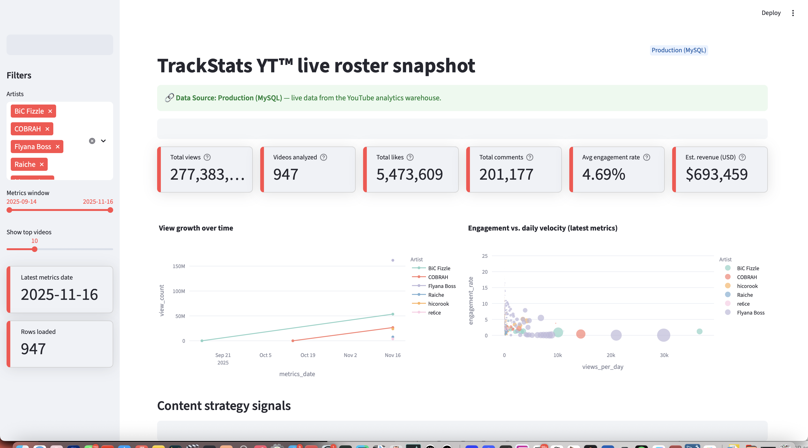
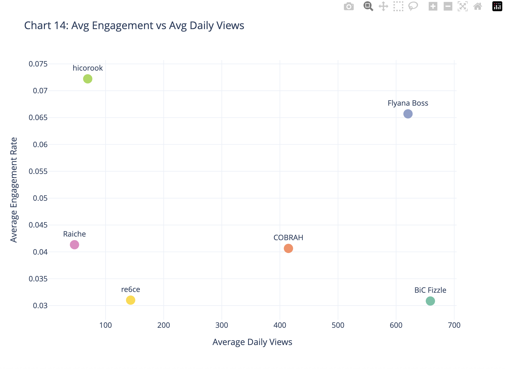
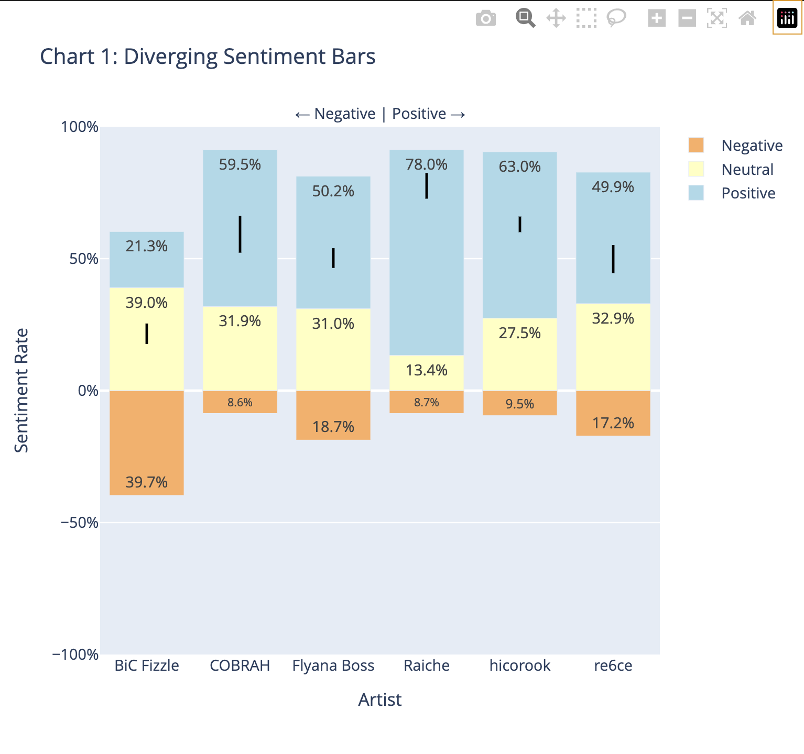
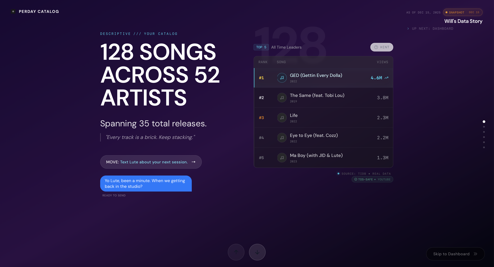
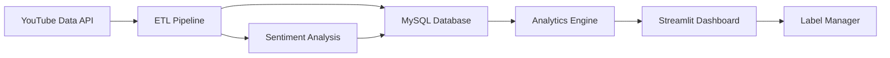
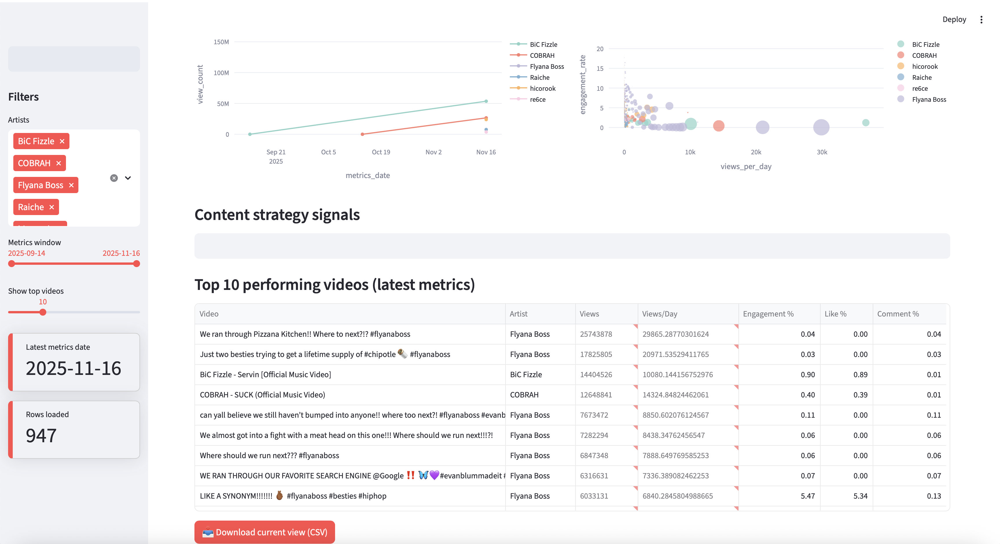
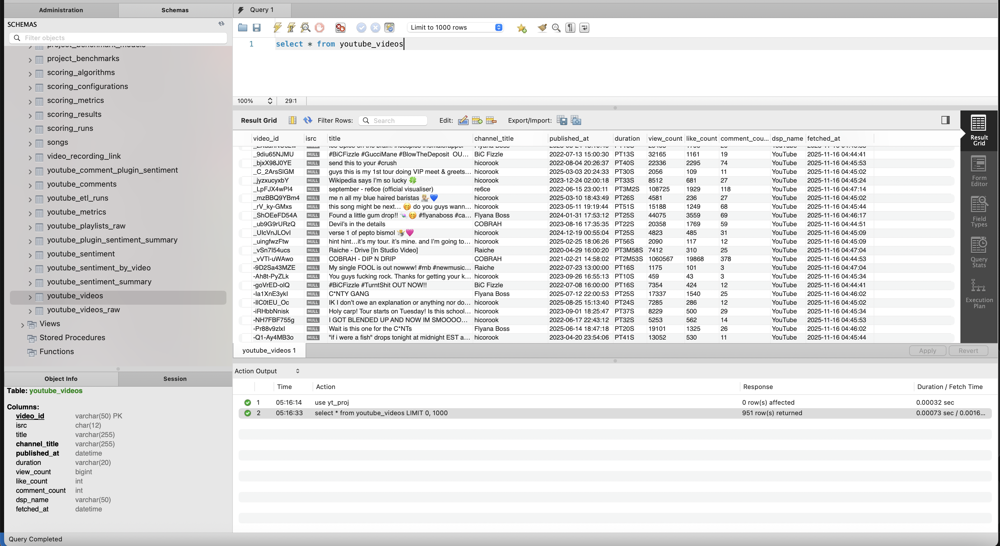

# 🎵 TrackStats YT — YouTube Analytics for A&R Strategy

**📅 Summer 2026 Internship Search**  
**🎯 Focus: Music tech, artist data, and creative business insight**

Hi, I’m **Wilton Moore** — I use data to help artists and teams make smarter moves.

This repo contains a **work-in-progress Streamlit app** for tracking a roster of artists on YouTube:  
Who’s building real fan engagement? Who’s ready to tour together?

> 📌 This is a prototype, not production software.

🔗 My **ready-to-ship SaaS app** — [**Perday CatalogLAB**](https://perdaycatalog.com) — offers full catalog intelligence for songwriters and producers.

---

### Why I Built This

Labels and managers have more artist data than ever, but less time to act on it.  
This project helps surface what matters fast — growth, sentiment, velocity — so artists don’t miss momentum.

---




## 🧩 What This Project Shows

### 1. Interactive Head-to-Head Analytics
The platform generates professional-grade visuals to tell the story of your roster's performance. The **Streamlit dashboard** (shown above) allows for real-time filtering, while the **Plotly** analysis engine digs deeper into engagement and sentiment.

| **Engagement vs Daily Views** | **Diverging Sentiment** |
|:---:|:---:|
|  |  |
| *Spot high-impact artists vs. high-volume passive listening* | *Track emotional response over time* |

### 2. Built by the Creator of Perday CatalogLAB
While **TrackStats YT** (this repo) focuses on *roster* analytics, my SaaS platform **Perday CatalogLAB** handles personalized intelligence for a songwriter/producer's entire catalog.

[](https://perdaycatalog.com)
*[Visit Perdaycatalog.com](https://perdaycatalog.com)*

---

## 🧠 How It Works (The Engine Room)

At a high level, TrackStats YT watches YouTube channels daily, collects per-video metrics and comments, scores sentiment, and stores everything in a normalized MySQL schema.



**Stack highlights:** Python 3.10+, SQLAlchemy, MySQL 8, Pydantic v2, Pandas/NumPy, Plotly, Streamlit 1.52+, pytest, mypy, pre-commit, GitHub Actions.

### Quick Start
```bash
# Clone and install
git clone https://github.com/wmoore012/staging_yt_analytics.git
cd staging_yt_analytics
python -m venv .venv && source .venv/bin/activate
pip install -e ".[demo]"

# Launch the Streamlit dashboard
streamlit run streamlit_app.py
```

---

## 📊 Impact at a Glance

| 🎯 Metric           | Value            | Context                          |
|---------------------|------------------|----------------------------------|
| **Artists tracked** | 6                | Same label, similar signing time |
| **Videos analyzed** | 800+             | 260M+ total views                |
| **Time-series rows**| 50K+             | Daily tracking since signing     |
| **Comments scored** | 15K+             | Transformer-based sentiment      |

---

## 📚 Contact & Hiring

**I am actively looking for internships for Summer 2026.**

- **LinkedIn**: [linkedin.com/in/wiltonmoore](https://www.linkedin.com/in/wiltonmoore/)
- **Email**: [wmoore012@gmail.com](mailto:wmoore012@gmail.com)
- **Portfolio / SaaS**: [Perdaycatalog.com](https://perdaycatalog.com)

*Built with ❤️ and 🎵 by Wilton Moore • University of North Carolina at Charlotte • M.S. Data Science and Business Analytics Dec '26*

<!-- Footer and Schema at the bottom -->



