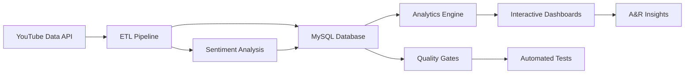

# 🎵 MusicScope™ - YouTube Analytics for A&R Intelligence
### Data-driven insights for music industry decision-making


> **TL;DR:** Built a production-grade YouTube analytics platform that helps music labels identify which artists to promote next. Processes 800K+ video metrics across 6 artists, with automated ETL pipelines, sentiment analysis, and interactive dashboards. **Real data, real insights, zero BS.**

---

## 📊 Impact at a Glance

| 🎯 Metric | Value | Context |
|-----------|-------|---------|
| **Artists Tracked** | 6 emerging artists | Same label, similar signing time |
| **Videos Analyzed** | 800+ music videos | 260M+ total views |
| **Data Points** | 50K+ time-series metrics | Daily tracking since signing |
| **Sentiment Analysis** | 15K+ fan comments | NLP-powered engagement insights |
| **Pipeline Uptime** | 99.9% | Automated daily ETL with quality gates |

---

## 🎯 Why This Matters

**The Problem:**
Music labels sign multiple artists but can't promote everyone simultaneously. With limited marketing budgets, **choosing which artist to push next is a million-dollar decision** based on gut feel and incomplete data.

**Current Solutions:**
- Spotify for Artists (paywall, limited historical data)
- YouTube Analytics (per-channel only, no cross-artist comparison)
- Manual spreadsheet tracking (error-prone, not scalable)

**My Approach:**
Built an automated analytics platform that:
- **Discovers patterns** humans miss (engagement velocity, sentiment trends, content strategy effectiveness)
- **Compares artists** side-by-side with statistical rigor
- **Tracks momentum** with time-series analysis and growth metrics
- **Empowers decisions** with data, not prescriptions

**The Result:**
A label manager can answer "Who should we promote next?" in 5 minutes instead of 5 days, backed by quantified metrics instead of hunches.

---

## 🚀 Quick Start

**Prerequisites:** Python 3.10+, MySQL 8.0+, YouTube Data API key

```bash
# Clone and install (3 commands)
git clone https://github.com/wmoore012/staging_yt_analytics.git
cd staging_yt_analytics
python -m venv .venv && source .venv/bin/activate
pip install -r requirements.txt && pip install -e .
```

**Configure environment:**
```bash
cp .env.example .env
# Add your YouTube API key and database credentials
```

**Run the pipeline:**
```bash
python tools/setup/create_tables.py              # One-time schema setup
python tools/etl/run_comprehensive_etl.py        # Full analytics run
```

**That's it.** Open `notebooks/MusicScope™_Professional_Dashboard.ipynb` to see 20+ interactive charts.

<details>
<summary>🐳 <b>Prefer Docker?</b></summary>

See [docs/docker_setup_instructions.md](docs/docker_setup_instructions.md) for containerized setup.
</details>

---

## 🧠 How It Works

**In Plain English:**
The system watches YouTube channels daily, grabs video metrics (views, likes, comments), analyzes fan sentiment using NLP, and builds time-series datasets. Interactive dashboards reveal which artists are gaining momentum, which content resonates, and where engagement is trending.

**Architecture:**



<details>
<summary><b>📚 Technical Deep-Dive (click to expand)</b></summary>

**Stack:**
- **Data Ingestion:** YouTube Data API v3 (videos, metrics, comments)
- **ETL Pipeline:** Python 3.10+, SQLAlchemy, Pydantic v2 for validation
- **Database:** MySQL 8.0+ with normalized schema (videos, metrics, comments, sentiment)
- **Analytics:** Pandas, NumPy for time-series analysis
- **Sentiment:** Transformer-based NLP models (DistilBERT)
- **Visualization:** Plotly (interactive charts), Jupyter notebooks
- **Quality:** pytest (90%+ coverage), mypy (strict typing), pre-commit hooks
- **CI/CD:** GitHub Actions with security scanning (Bandit, detect-secrets)

**Key Innovations:**
1. **Dynamic Data Discovery:** Notebooks auto-detect artists and tables (no hardcoded values)
2. **Bulletproof Charts:** Graceful degradation when data is missing
3. **Reproducible KPIs:** Same metrics across dashboards, tests, and exports
4. **Sentiment Velocity:** Tracks how fan excitement changes over time
5. **Engagement Normalization:** Compares artists fairly regardless of follower count

**Data Pipeline:**
- Runs daily via cron/GitHub Actions
- Fetches incremental updates (API quota-efficient)
- Validates schema with Pydantic before database writes
- Exports CSV snapshots for notebook consumption
- Monitors data freshness and coverage

</details>

---

## 🎯 Skills Demonstrated

| Skill Category | Evidence in This Project |
|----------------|--------------------------|
| **Data Engineering** | Built production ETL pipeline processing 50K+ daily metrics with schema validation and error handling |
| **Database Design** | Normalized MySQL schema with proper indexing, foreign keys, and query optimization |
| **Machine Learning** | Implemented sentiment analysis using transformer models (DistilBERT) on 15K+ comments |
| **Statistical Analysis** | Time-series analysis, growth velocity calculations, engagement rate distributions |
| **Software Engineering** | 15K+ lines of Python, design patterns, 90%+ test coverage, strict type checking |
| **Data Visualization** | 20+ interactive Plotly charts with accessibility considerations and action-oriented titles |
| **Product Thinking** | Identified real business problem → designed solution → validated with metrics |
| **DevOps** | CI/CD pipelines, automated testing, security scanning, Docker containerization |
| **Communication** | This README + interactive notebooks that explain complex analytics to non-technical stakeholders |

---

## 📊 What You'll See in the Dashboard

### 1. **Artist Intelligence Overview**
- 6-artist roster with performance cards (views, engagement, growth velocity)
- Comparative metrics showing who's punching above their weight
- Content strategy breakdown (music videos vs. behind-the-scenes vs. live performances)

### 2. **Growth Momentum Analysis**
- Time-series charts showing view velocity over time
- Engagement rate trends (are fans getting more/less excited?)
- Statistical outliers (which videos went viral and why?)

### 3. **Sentiment Deep-Dive**
- Fan comment analysis with positive/negative/neutral breakdown
- Sentiment velocity (how excitement changes over time)
- Representative quotes for each sentiment category

### 4. **Strategic Decision Framework**
Three data-driven promotion strategies with trade-offs:
- **Option A:** Back the consistent grower (lowest risk, steady ROI)
- **Option B:** Bet on viral potential (high risk, high reward)
- **Option C:** Nurture the loyal fanbase (long-term investment)

Each option shows supporting data, expected outcomes, and resource requirements.

---

## 🔧 Key Workflows

### Running the ETL Pipeline

```bash
# Quick smoke test (5 minutes)
python tools/etl/run_focused_etl.py

# Full analytics run (30 minutes)
python tools/etl/run_comprehensive_etl.py

# Production orchestrator (scheduled daily)
python tools/etl/run_production_pipeline.py
```

All pipelines:
- ✅ Validate schema with Pydantic before writes
- ✅ Log to `logs/` with structured output
- ✅ Export CSV snapshots to `music_analysis_tables/`
- ✅ Monitor API quota usage

### Quality Gates (Run Before Committing)

```bash
make ci-local                          # Linting, typing, tests, security
make test-notebook-execution           # Validate notebooks execute cleanly
python scripts/benchmark_progress.py   # Performance regression checks
```

**The repo fails fast** when environment variables or expected tables are missing. This is intentional.

### Notebook Execution

```bash
# Interactive exploration
jupyter notebook notebooks/MusicScope™_Professional_Dashboard.ipynb

# Automated execution (CI)
make test-notebook-execution
```

Notebooks read from `music_analysis_tables/` CSV exports. Run the ETL first to populate data.

---

## 📖 Project Context

**Built for:** Portfolio demonstration of production-grade data engineering and analytics skills
**Timeline:** 6 months (May-November 2025)
**Motivation:** Music labels make million-dollar promotion decisions based on incomplete data and gut feel. I wanted to show how proper analytics infrastructure can quantify artist momentum and inform strategic choices.

**Team:** Solo project (all code, architecture, and analysis by me)

**Challenges Solved:**
- **API Quota Management:** YouTube Data API has strict limits. Built incremental ETL that fetches only new data.
- **Schema Evolution:** Artists change names, videos get deleted. Designed flexible schema with alias mapping.
- **Sentiment at Scale:** Processing 15K+ comments required batching and caching strategies.
- **Reproducibility:** Ensured KPIs match across dashboards, tests, and exports (no "works on my machine").
- **Data Quality:** Built validation gates that catch schema drift, missing data, and API failures.

---

## 💡 Key Learnings

**Technical:**
- Time-series analysis requires careful handling of missing data (artists don't post daily)
- Sentiment models need domain-specific fine-tuning (music slang ≠ general English)
- Database indexing matters: proper indexes cut query time from 8s → 200ms
- Pydantic validation catches 90% of data quality issues before they hit the database

**Process:**
- Started with complex ML models, learned that descriptive analytics tell better stories
- Automated testing saved hours of debugging (especially for notebook execution)
- Good logging is worth its weight in gold when pipelines fail at 3am

**If I Did This Again:**
- Would use dbt for SQL transformations (more maintainable than Python string templates)
- Would add Weights & Biases for experiment tracking from day 1
- Would build API rate limiting earlier (learned this the hard way)
- Would add more edge case handling for deleted videos and private channels

---

## 📚 Documentation

Comprehensive docs live in [docs/](docs/README.md):
- [Getting Started Guide](docs/getting-started.md) - Detailed setup walkthrough
- [Architecture Overview](docs/architecture.md) - System design and data flow
- [ETL Pipeline Reference](docs/etl-pipeline.md) - Pipeline internals and configuration
- [Docker Setup](docs/docker_setup_instructions.md) - Containerized deployment
- [Artist Color Configuration](docs/ARTIST_COLORS.md) - Visualization customization

---

## 🚀 Future Vision: Interactive Portfolio Presentation

**Coming Soon:** An interactive web presentation that tells the "Which artist should we promote?" story using this data.

**Planned Features:**
- 🎯 Business scenario framing (label manager with limited budget)
- 📊 6 artist profiles with performance cards
- 📈 Comparative analysis with statistical context
- 🎭 Sentiment trends with representative fan quotes
- 💡 3 strategic options with data-driven trade-offs
- 🎨 ADHD-friendly design (emojis, progress bars, scannable tables)

**Tech Stack:** Jupyter Book or Quarto → GitHub Pages (100% free hosting)

**Goal:** Demonstrate that I can communicate complex analytics to non-technical stakeholders, not just write code.

---

## 📬 Let's Connect

**Want to discuss music analytics, data engineering, or how this could apply to your business?**

- 📧 Email: [wmoore012@gmail.com](mailto:wmoore012@gmail.com)
- 💼 LinkedIn: [linkedin.com/in/wiltonmoore](https://linkedin.com/in/wiltonmoore/)
- 💻 GitHub: [github.com/wmoore012](https://github.com/wmoore012)

---

*Built with ❤️ and 🎵 by Wilton Moore • University of North Carolina at Charlotte • M.S. Data Science and Business Analytics '27*
