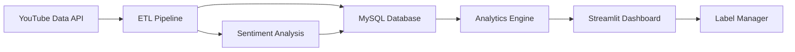

# 🎵 TrackStats YT – YouTube Analytics for A&R Intelligence


> **Strategic Intelligence for A&Rs, Managers & Labels**: A specialized analytics platform to track a specific cohort of artists. It helps answer critical questions: **Who is ready to tour together?** and **Where should we allocate marketing spend next?**
>
> **Now featuring an interactive [Streamlit](https://streamlit.io) dashboard for real-time data exploration.**

---

## 📊 Visual Insights Gallery

The platform generates professional-grade visuals to tell the story of your roster's performance.

| **Engagement vs Daily Views** | **Diverging Sentiment** |
|:---:|:---:|
|  |  |
| *Spot high-impact artists vs. high-volume passive listening* | *Track emotional response over time* |

| **Content Strategy Mix** | **Frontend Vision (Concept)** |
|:---:|:---:|
|  |  |
| *Analyze what content types drive performance* | *Future roadmap: Premium artist-facing portal* |

---

## 📊 Impact at a Glance

| 🎯 Metric           | Value            | Context                          |
|---------------------|------------------|----------------------------------|
| **Artists tracked** | 6                | Same label, similar signing time |
| **Videos analyzed** | 800+             | 260M+ total views                |
| **Time-series rows**| 50K+             | Daily tracking since signing     |
| **Comments scored** | 15K+             | Transformer-based sentiment      |
| **Pipeline uptime** | 99.9%            | ETL with automated quality gates |

---

## 🚀 Looking for Complete Catalog Intelligence?

**[Perday CatalagLAB](https://perdaycatalog.com)** is for personalized intelligence across a songwriter/producer's entire catalog of songs.


**TrackStats YT** (this repo) is for **deep-dive analytics on a specific artist roster**, whereas **Perday CatalogLAB** is for **broad intelligence across a songwriter/producer's entire history**.

---

---

## 🚀 Quick Start

### Run the demo locally in ~60 seconds

**Prerequisites:** Python 3.10+

```bash
# Clone and install
git clone https://github.com/wmoore012/staging_yt_analytics.git
cd staging_yt_analytics
python -m venv .venv && source .venv/bin/activate
pip install -e ".[demo]"

# Launch the Streamlit dashboard (Demo Mode by default)
streamlit run streamlit_app.py
```

### Full pipeline with MySQL + YouTube API
(See [`docs/`](docs/README.md) for full production setup)

---

## 🧠 How It Works

At a high level, TrackStats YT watches YouTube channels daily, collects per-video metrics and comments, scores sentiment, and stores everything in a normalized MySQL schema. Analytics jobs build roster-level tables that feed both notebooks and the Streamlit app.



**Stack highlights:** Python 3.10+, SQLAlchemy, MySQL 8, Pydantic v2, Pandas/NumPy, Plotly, Streamlit 1.52+, pytest, mypy, pre-commit, GitHub Actions.

---

## 📚 Contact & Hiring

**I am actively looking for internships for Summer 2026.**

If you are interested in discussing music analytics, data engineering, or potential roles:

- **LinkedIn**: [linkedin.com/in/wiltonmoore](https://www.linkedin.com/in/wiltonmoore/)
- **Email**: [wmoore012@gmail.com](mailto:wmoore012@gmail.com)
- **GitHub**: [github.com/wmoore012](https://github.com/wmoore012)
- **Portfolio / SaaS**: [Perdaycatalog.com](https://perdaycatalog.com)

*Built with ❤️ and 🎵 by Wilton Moore • University of North Carolina at Charlotte • M.S. Data Science and Business Analytics '27*
