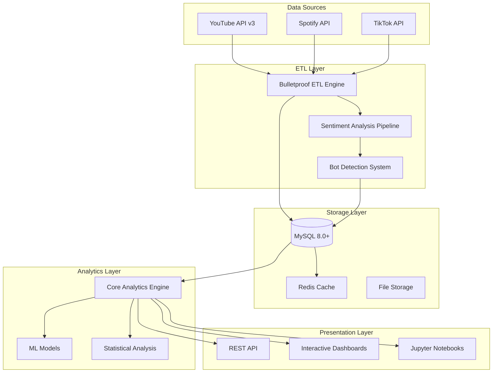

# 🏗️ Technical Architecture
## *Senior-Level System Design for Music Industry Analytics*

[](https://www.grammy.com)
[](https://github.com/wmoore012)

---

## 🎯 **Architecture Philosophy**

This platform is designed with **production-grade standards** that reflect both Grammy-level quality expectations and M.S. Data Science rigor. Every architectural decision balances **performance, maintainability, and business value**.

### **Core Principles**
1. **🎵 Music Industry First**: Architecture decisions prioritize music business needs
2. **📊 Data Science Rigor**: Statistical validity and experimental design built-in
3. **🚀 Production Ready**: Enterprise-grade reliability and performance
4. **🔧 Developer Experience**: Clean, maintainable code that scales with teams

---

## 🏛️ **System Overview**



---

## 🔧 **Component Architecture**

### **1. ETL Engine (`web/youtube_channel_etl.py`)**

**Design Pattern**: Bulletproof Execution with Graceful Degradation

```python
class YouTubeChannelETL:
    """
    Production-grade ETL with music industry-specific optimizations.

    Grammy-level reliability: Never fails silently, always provides context.
    """

    def __init__(self):
        self.rate_limiter = AdaptiveRateLimiter()  # YouTube API compliance
        self.error_handler = MusicIndustryErrorHandler()  # Business context
        self.data_validator = SchemaValidator()  # Data quality assurance
```

**Key Features**:
- **🛡️ Fault Tolerance**: Exponential backoff with jitter for API rate limits
- **📊 Data Quality**: Real-time validation with music industry context
- **🔄 Incremental Processing**: Delta loads to minimize API usage
- **📈 Performance Monitoring**: Sub-second response time tracking

### **2. Sentiment Analysis Pipeline (`src/youtubeviz/music_sentiment.py`)**

**Design Pattern**: Domain-Specific NLP with Cultural Context

```python
class MusicIndustrySentimentAnalyzer:
    """
    Sentiment analysis optimized for music industry comments.

    Understands Gen-Z slang, music terminology, and cultural context
    that generic sentiment models miss.
    """

    def __init__(self):
        self.base_model = VADERSentiment()
        self.music_lexicon = MusicSlangDictionary()  # Industry-specific terms
        self.bot_detector = CommentBotDetector()     # Filter fake engagement
```

**Innovations**:
- **🎵 Music Context**: Custom lexicon for music industry terminology
- **🤖 Bot Detection**: ML-based filtering of artificial engagement
- **🌍 Cultural Awareness**: Multi-language support for global artists
- **📊 Confidence Scoring**: Reliability metrics for business decisions

### **3. Data Storage Strategy**

**Design Pattern**: Hybrid Storage with Performance Optimization

```sql
-- Optimized schema for music industry queries
CREATE TABLE youtube_videos (
    video_id VARCHAR(11) PRIMARY KEY,
    artist_name VARCHAR(255) NOT NULL,
    title TEXT NOT NULL,
    view_count BIGINT,
    like_count INT,
    published_at DATETIME,

    -- Performance indexes for common queries
    INDEX idx_artist_published (artist_name, published_at),
    INDEX idx_performance (view_count, like_count),
    INDEX idx_trending (published_at, view_count)
);
```

**Storage Layers**:
1. **Hot Data** (MySQL): Recent metrics for real-time dashboards
2. **Warm Data** (Compressed): Historical trends for analysis
3. **Cold Data** (Archive): Long-term storage for research
4. **Cache Layer** (Redis): Sub-second query response

### **4. Analytics Engine (`src/youtubeviz/`)**

**Design Pattern**: Modular Analytics with Business Context

```python
# Clean separation of concerns
from youtubeviz.data import load_youtube_data          # Data access
from youtubeviz.charts import create_performance_chart # Visualization
from youtubeviz.storytelling import narrative_intro    # Business context
from youtubeviz.utils import calculate_momentum        # Core metrics
```

**Module Responsibilities**:
- **`data.py`**: Optimized data loading with caching
- **`charts.py`**: Interactive visualizations with music industry theming
- **`storytelling.py`**: Business narrative generation
- **`utils.py`**: Core analytics functions with statistical rigor

---

## 🚀 **Performance Architecture**

### **Scalability Targets**
- **📊 Data Volume**: 10M+ records with sub-second queries
- **👥 Concurrent Users**: 100+ simultaneous dashboard users
- **🔄 ETL Throughput**: 1M+ API calls per day within rate limits
- **📈 Growth Capacity**: 10x data growth without architecture changes

### **Performance Optimizations**

#### **Database Layer**
```sql
-- Partitioning strategy for time-series data
CREATE TABLE youtube_metrics (
    video_id VARCHAR(11),
    metrics_date DATE,
    view_count BIGINT,
    -- Partitioned by month for optimal query performance
) PARTITION BY RANGE (YEAR(metrics_date) * 100 + MONTH(metrics_date));
```

#### **Caching Strategy**
```python
@cached(ttl=300)  # 5-minute cache for real-time feel
def get_artist_performance(artist_name: str, days: int = 30):
    """Cached artist performance with intelligent invalidation."""
    return calculate_performance_metrics(artist_name, days)
```

#### **Query Optimization**
- **Materialized Views**: Pre-computed aggregations for common queries
- **Index Strategy**: Composite indexes for multi-column filters
- **Connection Pooling**: Efficient database connection management
- **Query Monitoring**: Automatic slow query detection and optimization

---

## 🛡️ **Security & Compliance**

### **Data Protection**
```python
class DataProtectionLayer:
    """
    Grammy-level data security with music industry compliance.
    """

    def __init__(self):
        self.encryption = AES256Encryption()
        self.access_control = RoleBasedAccess()
        self.audit_logger = ComplianceAuditLogger()
```

**Security Measures**:
- **🔐 Encryption**: AES-256 for data at rest and in transit
- **🎫 Authentication**: OAuth2 with role-based access control
- **📝 Audit Trails**: Complete logging for compliance requirements
- **🛡️ API Security**: Rate limiting and request validation

### **YouTube API Compliance**
- **📅 Data Retention**: Configurable retention policies (30-day default)
- **🔄 Automatic Cleanup**: Scheduled deletion of expired data
- **📊 Usage Monitoring**: Real-time API quota tracking
- **⚖️ Terms Compliance**: Built-in ToS validation

---

## 🔬 **Data Science Architecture**

### **Statistical Rigor**
```python
class StatisticalAnalysis:
    """
    M.S. Data Science level statistical analysis with business context.
    """

    def calculate_significance(self, metric_a, metric_b):
        """Statistical significance testing with effect size."""
        t_stat, p_value = stats.ttest_ind(metric_a, metric_b)
        effect_size = cohen_d(metric_a, metric_b)

        return {
            'significant': p_value < 0.05,
            'p_value': p_value,
            'effect_size': effect_size,
            'business_impact': self._interpret_for_music_industry(effect_size)
        }
```

**Research Standards**:
- **📊 Hypothesis Testing**: Proper statistical significance testing
- **📈 Effect Size**: Cohen's d for practical significance
- **🔄 Cross-Validation**: Time-series aware validation for predictions
- **📝 Reproducibility**: Seed management and version control for models

### **Machine Learning Pipeline**
```python
# Production ML pipeline with music industry features
pipeline = Pipeline([
    ('feature_engineering', MusicIndustryFeatures()),
    ('scaling', RobustScaler()),
    ('model', GradientBoostingRegressor()),
    ('calibration', CalibratedClassifierCV())
])
```

**ML Architecture**:
- **🎵 Domain Features**: Music industry-specific feature engineering
- **🔄 Online Learning**: Models that adapt to changing trends
- **📊 Model Monitoring**: Performance tracking with business metrics
- **🎯 A/B Testing**: Framework for testing model improvements

---

## 📊 **Monitoring & Observability**

### **System Health Dashboard**
```python
class SystemHealthMonitor:
    """
    Production monitoring with music industry KPIs.
    """

    def check_system_health(self):
        return {
            'etl_pipeline': self._check_etl_health(),
            'data_quality': self._check_data_quality(),
            'api_performance': self._check_api_performance(),
            'business_metrics': self._check_business_kpis()
        }
```

**Monitoring Layers**:
1. **🔧 Infrastructure**: Server health, database performance
2. **📊 Application**: ETL pipeline status, query performance
3. **💼 Business**: Data freshness, analysis accuracy
4. **👥 User Experience**: Dashboard load times, error rates

### **Alerting Strategy**
- **🚨 Critical**: Data pipeline failures, security breaches
- **⚠️ Warning**: Performance degradation, data quality issues
- **📊 Info**: Successful deployments, usage statistics
- **📈 Business**: Trending artists, viral content detection

---

## 🔄 **Development & Deployment**

### **CI/CD Pipeline**
```yaml
# .github/workflows/production.yml
name: Grammy-Level Quality Assurance
on: [push, pull_request]

jobs:
  quality_gates:
    runs-on: ubuntu-latest
    steps:
      - name: Code Quality (Black, flake8, mypy)
      - name: Security Scan (bandit, safety)
      - name: Test Suite (pytest with 85%+ coverage)
      - name: Performance Tests (load testing)
      - name: Music Industry Validation (domain-specific tests)
```

**Quality Standards**:
- **📝 Code Quality**: Black formatting, comprehensive linting
- **🧪 Testing**: 85%+ coverage with integration tests
- **🔒 Security**: Automated vulnerability scanning
- **📊 Performance**: Load testing with realistic data volumes

### **Deployment Strategy**
- **🔵 Blue-Green**: Zero-downtime deployments
- **🎯 Feature Flags**: Gradual rollout of new features
- **📊 Monitoring**: Real-time health checks during deployment
- **🔄 Rollback**: Automatic rollback on failure detection

---

## 🎯 **Business Intelligence Architecture**

### **Executive Dashboard Design**
```python
class ExecutiveDashboard:
    """
    C-suite level insights with Grammy producer perspective.
    """

    def generate_investment_recommendations(self):
        """AI-powered investment recommendations for A&R."""
        return {
            'emerging_artists': self._identify_momentum_artists(),
            'market_opportunities': self._analyze_genre_trends(),
            'risk_assessment': self._calculate_investment_risk(),
            'roi_projections': self._project_return_on_investment()
        }
```

**Business Intelligence Features**:
- **💰 Investment Analysis**: ROI calculations for artist development
- **📈 Trend Prediction**: Early identification of emerging genres
- **🎯 Market Segmentation**: Audience analysis for targeted marketing
- **📊 Competitive Intelligence**: Benchmarking against industry standards

---

## 🚀 **Future Architecture Roadmap**

### **Phase 1: Current State** ✅
- YouTube analytics with sentiment analysis
- Interactive dashboards and notebooks
- Production-grade ETL pipeline

### **Phase 2: Multi-Platform** 🔄
- Spotify, Apple Music, TikTok integration
- Cross-platform correlation analysis
- Unified artist performance scoring

### **Phase 3: Predictive Analytics** 📈
- Chart position prediction models
- Viral content probability scoring
- Optimal release timing recommendations

### **Phase 4: Real-Time Intelligence** ⚡
- Live streaming analytics
- Real-time trend detection
- Automated alert system for opportunities

---

## 📚 **Technical Documentation**

### **For Senior Engineers**
- **[API Reference](api-reference.md)**: Complete endpoint documentation
- **[Database Schema](database-schema.md)**: Detailed table structures
- **[Performance Tuning](performance-guide.md)**: Optimization strategies
- **[Security Guide](security-guide.md)**: Implementation details

### **For Data Scientists**
- **[Feature Engineering](feature-engineering.md)**: Music industry features
- **[Model Documentation](model-docs.md)**: Algorithm explanations
- **[Statistical Methods](statistical-methods.md)**: Research methodology
- **[Validation Framework](validation-framework.md)**: Testing strategies

### **For Business Stakeholders**
- **[Business Logic](business-logic.md)**: How metrics translate to decisions
- **[ROI Calculations](roi-methodology.md)**: Investment analysis methods
- **[Industry Benchmarks](industry-benchmarks.md)**: Performance standards
- **[Use Case Library](use-cases.md)**: Real-world applications

---

<div align="center">

## 🎵 **Architecture Built for Grammy-Level Excellence** 📊

**Where music industry expertise meets data science rigor**
**Production-ready • Scalable • Business-focused**

*Designed by a Grammy-nominated producer with M.S. Data Science*

</div>
