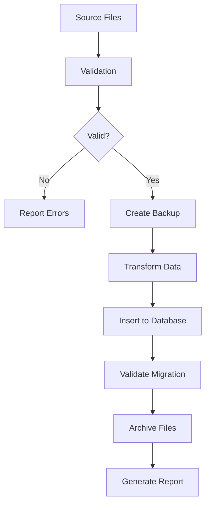

# Data Migration System

A comprehensive system for migrating CSV/JSON data files to database tables with validation, backup, and archiving capabilities.

## Overview

The Data Migration System consolidates scattered data files throughout the codebase into organized database tables while maintaining data integrity and providing comprehensive validation. It supports both CSV and JSON file formats with flexible mapping configurations.

## Features

- **CSV/JSON Migration**: Migrate data files to database tables with column mapping
- **Data Validation**: Comprehensive validation of file structure and data integrity
- **Backup & Recovery**: Create backups before migration with rollback capabilities
- **File Archiving**: Archive successfully migrated files to prevent duplication
- **Automatic Mapping**: Built-in mappings for known file types
- **Error Handling**: Robust error handling with detailed reporting
- **CLI Interface**: Command-line tool for easy migration operations

## Quick Start

### Basic Usage

```bash
# Migrate CSV files from music_analysis_tables directory
python tools/migration/migrate_data_files.py --source music_analysis_tables --type csv

# Migrate JSON config files
python tools/migration/migrate_data_files.py --source config --type json

# Migrate all files with backup and archiving
python tools/migration/migrate_data_files.py --source . --type all --backup --archive data/migrated
```

### Dry Run

```bash
# See what would be migrated without actually doing it
python tools/migration/migrate_data_files.py --source music_analysis_tables --dry-run
```

### Demonstration

```bash
# Run the interactive demonstration
python tools/migration/demo_migration_system.py
```

## Architecture

### Core Components

1. **DataMigrator**: Main migration engine
2. **MigrationResult**: Result tracking and reporting
3. **ValidationResult**: Data validation results
4. **CLI Tool**: Command-line interface
5. **Automatic Mapping**: Built-in file type detection

### Migration Workflow



## Configuration

### Table Mappings

The system supports flexible table mappings for different file types:

#### CSV Mapping Example

```json
{
  "csv_mappings": {
    "artist_music_summary.csv": {
      "table": "artist_performance_summary",
      "columns": {
        "artist_name": "artist_name",
        "total_videos": "total_videos",
        "total_views": "total_views",
        "avg_engagement_rate": "avg_engagement_rate"
      }
    }
  }
}
```

#### JSON Mapping Example

```json
{
  "json_mappings": {
    "artist_aliases.json": {
      "table": "artist_aliases",
      "key_column": "alias_name",
      "value_column": "canonical_name",
      "transform": "key_value_pairs"
    }
  }
}
```

### Built-in Mappings

The system includes automatic mappings for common file types:

- `artist_music_summary.csv` → `artist_performance_summary` table
- `normalized_music_videos.csv` → `music_videos_normalized` table
- `video_type_analysis.csv` → `video_type_analysis_summary` table
- `artist_aliases.json` → `artist_aliases` table
- `artist_colors.json` → `artist_visualization_config` table

## API Reference

### DataMigrator Class

```python
from src.data_organization.data_migrator import DataMigrator

# Initialize with database engine
migrator = DataMigrator(engine=database_engine)

# Migrate CSV files
result = migrator.migrate_csv_files(
    source_dir="path/to/csv/files",
    table_mapping=csv_mapping_config
)

# Migrate JSON files
result = migrator.migrate_json_files(
    source_dir="path/to/json/files",
    table_mapping=json_mapping_config
)

# Create backup
backup_result = migrator.create_backup(file_list)

# Archive files
archive_result = migrator.archive_migrated_files(
    source_files=file_list,
    archive_dir="archive/directory"
)
```

### Migration Result

```python
# Check migration status
if result.success:
    print(f"Migrated {result.records_migrated} records")
    print(f"Processed {len(result.source_files)} files")
else:
    print("Migration failed:")
    for error in result.errors:
        print(f"  - {error}")

# Generate detailed report
report = result.generate_report()
print(report)
```

## CLI Reference

### Command Options

- `--source SOURCE`: Source directory containing files to migrate (required)
- `--type {csv,json,all}`: Type of files to migrate (default: all)
- `--config CONFIG`: Path to custom migration configuration JSON file
- `--backup`: Create backup before migration
- `--archive ARCHIVE`: Archive directory for successfully migrated files
- `--dry-run`: Show what would be migrated without actually doing it
- `--validate`: Validate migration results after completion

### Examples

```bash
# Basic migration
python migrate_data_files.py --source data/csv_files --type csv

# With backup and archiving
python migrate_data_files.py \
  --source data/mixed_files \
  --type all \
  --backup \
  --archive data/archive

# Using custom configuration
python migrate_data_files.py \
  --source data/custom \
  --config custom_mapping.json

# Dry run to preview changes
python migrate_data_files.py \
  --source data/test \
  --dry-run
```

## Error Handling

The system provides comprehensive error handling:

### Common Errors

1. **File Not Found**: Source files or directories don't exist
2. **Schema Validation**: CSV columns don't match expected schema
3. **Database Errors**: Connection issues or SQL execution failures
4. **Data Integrity**: Migrated data doesn't match source data

### Error Recovery

- **Backup System**: Automatic backup creation before migration
- **Rollback Capability**: Restore from backup if migration fails
- **Partial Success**: Continue processing other files if one fails
- **Detailed Logging**: Comprehensive error messages and stack traces

## Testing

### Running Tests

```bash
# Run unit tests
python -m pytest tests/test_data_migrator.py -v

# Run integration tests
python -m pytest tests/test_data_migration_integration.py -v

# Run all migration tests
python -m pytest tests/test_data_migrator.py tests/test_data_migration_integration.py -v
```

### Test Coverage

The test suite covers:

- CSV and JSON file migration
- Data validation and integrity checking
- Backup and archiving functionality
- Error handling and recovery
- Automatic mapping detection
- CLI tool functionality

## Best Practices

### Before Migration

1. **Backup Data**: Always create backups before migration
2. **Test Mappings**: Use dry-run to verify mappings are correct
3. **Check Schema**: Ensure target database tables exist
4. **Validate Files**: Check file formats and data quality

### During Migration

1. **Monitor Progress**: Watch for errors and warnings
2. **Check Logs**: Review detailed logs for issues
3. **Validate Results**: Verify data integrity after migration
4. **Handle Errors**: Address any validation failures

### After Migration

1. **Archive Files**: Move migrated files to archive directory
2. **Verify Data**: Query database to confirm migration success
3. **Update Documentation**: Record migration details
4. **Clean Up**: Remove temporary files and backups if successful

## Troubleshooting

### Common Issues

**Issue**: "Missing required columns" error
**Solution**: Check CSV file headers match the mapping configuration

**Issue**: "Database insertion failed" error
**Solution**: Verify database connection and table schema

**Issue**: "File not found" warning
**Solution**: Ensure all files in mapping exist in source directory

**Issue**: "Data integrity" validation error
**Solution**: Check for data corruption or transformation issues

### Debug Mode

Enable detailed logging for troubleshooting:

```python
import logging
logging.basicConfig(level=logging.DEBUG)
```

## Contributing

### Adding New File Types

1. Add mapping to `get_table_mapping_for_file()` method
2. Create corresponding database table
3. Add tests for the new file type
4. Update documentation

### Extending Functionality

1. Follow existing patterns for new features
2. Add comprehensive tests
3. Update CLI tool if needed
4. Document new functionality

## License

This migration system is part of the YouTube ETL & Analytics Platform and follows the same licensing terms.
